# Product Hands-on Lab - Modern .NET API

Welcome to this hands-on lab! In this workshop, you will learn how to build a modern .NET API using ASP.NET Core Minimal APIs, Azure SQL Database, Azure Blob Storage, and Application Insights. You will implement a document management API that allows users to upload, search, and download documents while following best practices for API design, security, and observability.

---

## Prerequisites

Before starting this lab, be sure to set your Azure environment :

- An Azure Subscription with the **Contributor** role to create and manage the labs' resources and deploy the infrastructure as code
- Register the Azure providers on your Azure Subscription if not done yet: `Microsoft.Storage`, `Microsoft.Sql`, `Microsoft.Insights`, `Microsoft.OperationalInsights`.

To retrieve the lab content :

- A GitHub account (Free, Team or Enterprise)
- Create a [fork][repo-fork] of the repository from the **main** branch to help you keep track of your changes

### Setup your local environment

The following tools and access will be necessary to run the lab on a local environment:  

- [Git client][git-client]
- [Visual Studio][visual-studio] installed
- [Azure CLI][az-cli-install] installed on your machine
- [Terraform][download-terraform] installed on your machine (to deploy the infrastructure as code)
- [Docker Desktop][docker-desktop] installed on your machine

Once you have set up your local environment, you can clone the repository you just forked on your machine, and open the solution in Visual Studio.

### Sign in to Azure

> - Log into your Azure subscription in your environment using Azure CLI and on the [Azure Portal][az-portal] using your credentials.
> - Register the Azure providers on your Azure Subscription if not done yet: `Microsoft.Storage`, `Microsoft.Sql`, `Microsoft.Insights`, `Microsoft.OperationalInsights`.

```bash
# Login to Azure : 
# --tenant : Optional | In case your Azure account has access to multiple tenants

# Option 1 : Local Environment 
az login --tenant <yourtenantid or domain.com>
# Option 2 : Github Codespace : you might need to specify --use-device-code parameter to ease the az cli authentication process
az login --use-device-code --tenant <yourtenantid or domain.com>

# Display your account details
az account show
# Select your Azure subscription
az account set --subscription <subscription-id>

# Register the following Azure providers if they are not already
# Azure Storage
az provider register --namespace 'Microsoft.Storage'
# Azure SQL
az provider register --namespace 'Microsoft.Sql'
# Azure Monitor
az provider register --namespace 'Microsoft.Insights'
# Azure Log Analytics
az provider register --namespace 'Microsoft.OperationalInsights'
```

### Deploy the infrastructure

First, you need to initialize the terraform infrastructure by running the following command:

```bash
# Run the following line which will dynamically set the subscription ID as an environment variable:
# On Bash or Zsh:
export ARM_SUBSCRIPTION_ID=$(az account show --query id -o tsv)
# On Windows PowerShell:
$env:ARM_SUBSCRIPTION_ID = (az account show --query id -o tsv)

# Initialize terraform
cd infra && terraform init
```

Then run the following command to deploy the infrastructure:

```bash
# Apply the deployment directly
terraform apply -auto-approve
```

The deployment should take around 5 minutes to complete.

[az-cli-install]: https://learn.microsoft.com/en-us/cli/azure/install-azure-cli
[az-portal]: https://portal.azure.com
[visual-studio]: https://visualstudio.microsoft.com/
[vs-code]: https://code.visualstudio.com/
[docker-desktop]: https://www.docker.com/products/docker-desktop/
[repo-fork]: https://github.com/damienaicheh/hands-on-lab-agent-framework-on-azure/fork
[git-client]: https://git-scm.com/downloads
[github-account]: https://github.com/join
[download-terraform]: https://developer.hashicorp.com/terraform/install

---

# Lab 1 - Setup Swagger in your API

Welcome to the first lab of the Document API workshop. In this step, you will expose an OpenAPI document for the Minimal API and make the first endpoints visible in Swagger UI.

The goal is intentionally small: understand where the API is wired, then add just enough metadata so the application becomes easy to discover and test.

You are not building business behavior yet. You are preparing the API surface so every next lab can be tested from a browser and described by an OpenAPI contract.

## What You Will Learn

In this lab, you will:

- Explore the `DocumentAPI` Minimal API entry point.
- Prepare the local application settings from the provided template.
- Register the ASP.NET Core endpoint explorer and Swagger generator.
- Enable Swagger UI in the development environment.
- Add the first metadata on document endpoints.
- Verify that the OpenAPI document is generated.

## Files To Open

You only need to edit these files:

- `src/DocumentAPI/appsettings.json`
- `src/DocumentAPI/Program.cs`
- `src/DocumentAPI/Endpoints/DocumentEndpoints.cs`

The health endpoint, DTOs, packages, and starter tests are already provided.

<div class="tip" data-title="Keep the scope small">

> This lab is about API discoverability. Do not implement upload, search, download, SQL, or storage yet. Those parts are intentionally incomplete in the starter.

</div>

## Get the Starter Code

Download the **starter.zip** file for these labs from the [releases page][starter-latest].

## Prepare Local Settings

Before changing the API code, inside `src/DocumentAPI/` duplicate the `appsettings.json.template` file and rename the copy `appsettings.json`. This will create your local settings file from the provided template. The API reads `appsettings.json` when it starts, and the template contains placeholders for the Azure resources deployed in the prerequisites.

From the repository root, run:

Open `src/DocumentAPI/appsettings.json` and replace the placeholder values as described below:

```json
{
	"DocumentApi": {
		// ...
		"ApplicationInsights": {
			// ...
			"ConnectionString": "<Your Application Insights Connection String>"
			// ...
		},
		// ...
		"Storage": {
			// ...
			"ServiceUri": "https://<YOUR STORAGE ACCOUNT NAME>.blob.core.windows.net/",
			"ContainerName": "documents"
			// ...
		},
		"Database": {
			"ServiceUri": "https://<YOUR SQL SERVER NAME>.database.windows.net",
			"DatabaseName": "DocumentDb"
		}
		// ...
	}
}
```

Use the Azure resources created during the prerequisite setup:

- `DocumentApi:ApplicationInsights:ConnectionString`: in the Azure portal, open the Application Insights resource named `appi-...`, then copy **Connection String** from the **Overview** page.
- `DocumentApi:Storage:ServiceUri`: in the Azure portal, inside your resource group, copy the name of the Storage Account named `st...`, and update the placeholder. It should look like `https://<storage-account-name>.blob.core.windows.net/`.
- `DocumentApi:Database:ServiceUri`: in the Azure portal, inside your resource group, copy the name of the SQL Server resource named `sql-...`, and update the placeholder. It should look like `https://<server-name>.database.windows.net`.

Keep the rest of the settings as they are. You will use them in later labs when you implement the database and storage behavior.

## Register Swagger Services

Open `src/DocumentAPI/Program.cs` and find the Lab 1 TODO around Swagger services.

Minimal APIs do not use controllers, so Swagger needs the endpoint explorer to discover route handlers and their metadata. Think of this as the bridge between your route declarations and the generated OpenAPI contract.

Replace it with:

```csharp
builder.Services.AddEndpointsApiExplorer();
builder.Services.AddSwaggerGen(options =>
{
	var xmlFileName = $"{Assembly.GetExecutingAssembly().GetName().Name}.xml";
	var xmlPath = Path.Combine(AppContext.BaseDirectory, xmlFileName);

	if (File.Exists(xmlPath))
	{
		options.IncludeXmlComments(xmlPath, includeControllerXmlComments: true);
	}
});
```

`AddEndpointsApiExplorer` lets Minimal API endpoints appear in OpenAPI. `AddSwaggerGen` creates the Swagger document.

## Enable Swagger UI

Still in `Program.cs`, find the Lab 1 TODO inside the `IsDevelopment()` block and add:

```csharp
app.UseSwagger();
app.UseSwaggerUI();
```

This enables two things: the raw Swagger JSON document and the interactive Swagger UI page. Keeping it in the development block avoids exposing the UI by accident in another environment (in production typically).

Swagger UI stays development-only so the runtime pipeline remains clean outside local development.

## Add Endpoint Metadata

Open `DocumentEndpoints.cs` and enrich the document routes with OpenAPI metadata:

The metadata you add here is not only for the Swagger UI page. It's all the endpoints that will be visible in the generated OpenAPI document, which can be used by any OpenAPI consumer, such as Postman, code generators, or API gateways.

```csharp
v1Group.MapGet("/search", SearchAsync)
	.WithName("Documents_search")
	.Produces<IReadOnlyList<DocumentDto>>(StatusCodes.Status200OK)
	.ProducesProblem(StatusCodes.Status400BadRequest)
	.ProducesProblem(StatusCodes.Status500InternalServerError);

v1Group.MapPost("/", UploadAsync)
	.WithName("Documents_upload")
	.Accepts<IFormFile>("multipart/form-data")
	.Produces<DocumentDto>(StatusCodes.Status201Created)
	.ProducesProblem(StatusCodes.Status400BadRequest);

v1Group.MapGet("/{id}/content", DownloadAsync)
	.WithName("Documents_download")
	.Produces(StatusCodes.Status200OK)
	.ProducesProblem(StatusCodes.Status404NotFound);
```

You will add more response codes later as the API becomes more complete.

## Run The API

Build the project using the **Run** button in your IDE or the following command lines:

```bash
dotnet run --project src/DocumentAPI/DocumentAPI.csproj
```

Open Swagger UI at:

```txt
https://localhost:<port>/swagger
```

You must see something like this, with the three document endpoints visible:

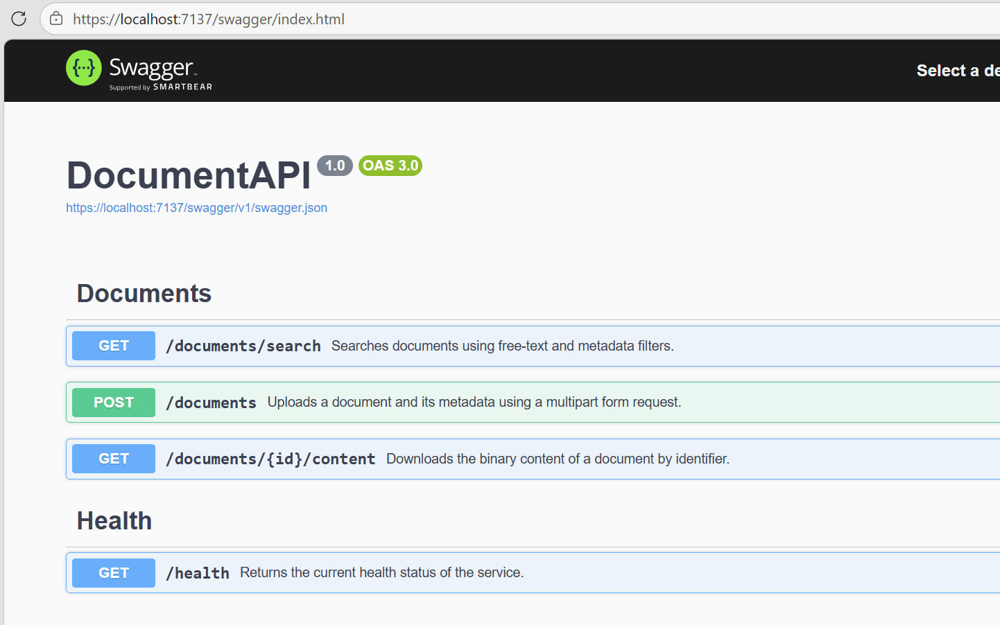

<div class="task" data-title="Validation">

> Confirm that Swagger UI opens and shows the document endpoints.
>
> The handlers can still throw `NotImplementedException`; that is expected at this stage.

</div>

[starter-latest]: https://github.com/damienaicheh/hands-on-lab-modern-dotnet-api/releases

---

# Lab 2 - SQL Database and Dependency Injection

In this lab, you will add SQL Server persistence for document metadata. The API will still not upload documents end-to-end, but the persistence layer will be ready for the next labs.

The starter already provides the `Document` entity, database options, Entity Framework Core mapping, migration files, and Azure SQL authentication helper. Your job is to connect those pieces through `DocumentDbContext` and dependency injection.

At the end of this lab, the API will know how to talk to the database, even if no endpoint is using it fully yet.

## What You Will Learn

In this lab, you will:

- Expose a `DbSet<Document>` from the Entity Framework Core context.
- Apply entity configurations from the current assembly.
- Register `DocumentDbContext` in the application container.
- Initialise the database when the application starts.
- Build a SQL Server connection string from strongly typed options.

## Files To Open

You only need to edit these files:

- `src/DocumentAPI/Persistence/DocumentDbContext.cs`
- `src/DocumentAPI/Services/DependencyInjection.cs`

The entity, options, mappings, and migration are already provided.

## Complete The DbContext

Open `DocumentDbContext.cs` and expose the document metadata set:

The `DbContext` is the unit of work for Entity Framework Core. It is the object your services will use to query and save document metadata without writing SQL by hand. For this lab you only need to expose a `DbSet<Document>`, which represents the table of documents in the database. Each `Document` instance corresponds to a row in that table.

```csharp
public DbSet<Document> Documents => Set<Document>();
```

You can check the `Document` class inside the `Entities` folder.

Then apply the Entity Framework Core configurations by overriding `OnModelCreating` in this class:

```csharp
protected override void OnModelCreating(ModelBuilder modelBuilder)
{
	base.OnModelCreating(modelBuilder);
	modelBuilder.ApplyConfigurationsFromAssembly(typeof(DocumentDbContext).Assembly);
}
```

This keeps table mapping, indexes, and column details in `DocumentConfiguration.cs`.

## Register SQL Server

Open `DependencyInjection.cs` and register the context inside `AddDocumentServices`:

Registering the context in dependency injection lets services ask for `DocumentDbContext` through their constructor. ASP.NET Core then creates it with the right lifetime for each request.

```csharp
services.AddDbContext<DocumentDbContext>(builder => ConfigureDatabase(builder, options.Database));
```

As you can see the database configuration is reading the appsettings through `DocumentApiOptions`, which contains all the configuration for the API. We point to the `Database` section of the configuration, which you filled in the previous lab.

Then implement startup migration:

```csharp
public static async Task InitializeDocumentDatabaseAsync(
	this IServiceProvider services,
	CancellationToken cancellationToken = default)
{
	using var scope = services.CreateScope();
	var dbContext = scope.ServiceProvider.GetRequiredService<DocumentDbContext>();

	await dbContext.Database.MigrateAsync(cancellationToken);
}
```

<div class="tip" data-title="Why migrations at startup?">

> For this hands-on lab, applying migrations at startup keeps the environment simple. In production, database changes can be deployed using the API code or custom scripts outside of the application. Both approaches are valid, and the best choice depends on your operational practices and risk management.

</div>

## Configure The SQL Provider

The workshop uses identity-based access to all services. That means the application receives a token through the `DefaultAzureCredential` class from the Azure Identity library instead of storing a SQL username and password in configuration.

Add the provider configuration:

```csharp
private static void ConfigureDatabase(DbContextOptionsBuilder builder, DocumentDatabaseOptions databaseOptions)
{
	if (string.IsNullOrWhiteSpace(databaseOptions.ServiceUri))
	{
		throw new InvalidOperationException("DocumentApi:Database:ServiceUri must be configured.");
	}

	if (string.IsNullOrWhiteSpace(databaseOptions.DatabaseName))
	{
		throw new InvalidOperationException("DocumentApi:Database:DatabaseName must be configured.");
	}

	var credential = new DefaultAzureCredential();
	builder
		.UseSqlServer(CreateSqlConnectionStringFromSettings(databaseOptions.ServiceUri, databaseOptions.DatabaseName))
		.AddInterceptors(new AzureSqlAuthenticationInterceptor(credential));
}
```

As you can see, the connection string is built from the configured service URI and database name. The `AzureSqlAuthenticationInterceptor` takes care of requesting a token for the database on every connection attempt.

Now add the helper that converts the configured server URI into a SQL connection string:

```csharp
private static string CreateSqlConnectionStringFromSettings(string serviceUri, string databaseName)
{
	var uri = new Uri(serviceUri, UriKind.Absolute);
	var builder = new SqlConnectionStringBuilder
	{
		DataSource = uri.IsDefaultPort ? uri.Host : $"{uri.Host},{uri.Port}",
		InitialCatalog = Uri.UnescapeDataString(databaseName),
		Encrypt = true,
		TrustServerCertificate = false,
		ConnectTimeout = 30,
	};

	return builder.ConnectionString;
}
```

## Start The Project

Start the project using the **Run** button in your Visual Studio or the following command lines:

```bash
dotnet run --project src/DocumentAPI/DocumentAPI.csproj
```

**After** the webbrowser opens, go to your Azure resource group and open your Database named `DocumentDb` in Azure and check the "Query editor (preview)" blade. You should see the `Documents` table there, which means the API successfully applied the migration at startup.

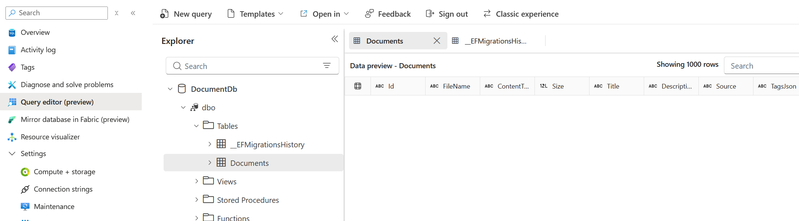

and also the migration history table with the initial migration applied:

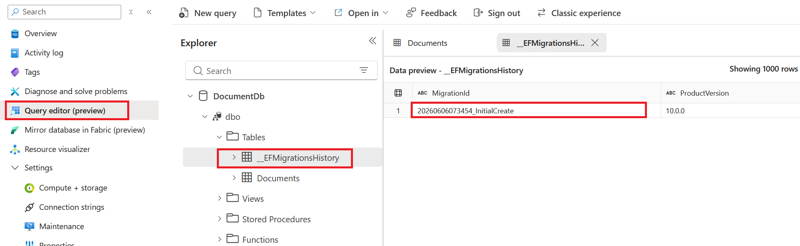

<div class="task" data-title="Validation">

> The project should build successfully.
>
> You now have SQL metadata persistence registered, even though upload is not complete yet.

</div>

---

# Lab 3 - Blob Storage Integration

In the previous lab, you wired SQL Server to store the file metadata of your documents. Now you will add Azure Blob Storage for the binary content of uploaded documents.

The API keeps metadata and content separated: SQL Server stores searchable properties, while Blob Storage stores the file bytes.

This separation is common in document systems: the database is great for filters and relationships, while storage accounts are built for durable file content.

## What You Will Learn

In this lab, you will:

- Instantiate a `BlobServiceClient` from the Azure SDK with `DefaultAzureCredential`.
- Resolve the configured blob container.
- Implement the storage service methods to:
	- Save content to Blob Storage.
	- Open document content for download.
	- Delete content when cleanup is required.
- Register the storage service in dependency injection.

## Files To Open

You only need to edit these files:

- `src/DocumentAPI/Services/Storage/AzureBlobDocumentStorageService.cs`
- `src/DocumentAPI/Services/DependencyInjection.cs`

The storage interface, options, packages, and configuration keys are already provided.

## Create The Blob Client

Open `AzureBlobDocumentStorageService.cs` and implement the constructor:

Blob Storage is the right place for the binary file content because it is optimized for streams and large objects. SQL Server stays focused on metadata that you need to query. The file uploaded will be stored as a blob.

```csharp
public AzureBlobDocumentStorageService(IOptions<DocumentApiOptions> options)
{
	var storageOptions = options.Value.Storage;
	var credential = new DefaultAzureCredential();
	var blobServiceClient = new BlobServiceClient(new Uri(storageOptions.ServiceUri), credential);
	_containerClient = blobServiceClient.GetBlobContainerClient(storageOptions.ContainerName);
}
```

As you can see, the Azure SDK client is straightforward to instantiate. The `ServiceUri` and `ContainerName` come from configuration, and the credential uses `DefaultAzureCredential`, which is a great option for local development and Azure-hosted environments. Locally, it can use your Azure CLI sign-in, and in Azure, it can use a managed identity if configured.

## Save Content

The storage service receives a stream, not a byte array. This keeps the API friendly to larger files because callers do not need to load everything into memory before saving.

Implement `SaveAsync`:

```csharp
public async Task SaveAsync(string contentHash, Stream content, byte[] md5Hash, CancellationToken cancellationToken)
{
	await EnsureInitializedAsync(cancellationToken);

	var blobClient = _containerClient.GetBlobClient(contentHash);
	await blobClient.UploadAsync(content, cancellationToken);
}
```

The blob name uses the content hash. This makes duplicate content easier to detect in later labs. As you can see the Azure SDK makes it easy to upload a stream with `UploadAsync`.

## Open And Delete Content

Deletion is used later when the upload workflow needs to roll back a blob after a database failure. Keeping it in the storage abstraction makes the business service easier to read.

Implement `DeleteAsync`:

```csharp
public async Task DeleteAsync(string contentHash, CancellationToken cancellationToken)
{
	await EnsureInitializedAsync(cancellationToken);
	await _containerClient.DeleteBlobIfExistsAsync(
		contentHash,
		DeleteSnapshotsOption.IncludeSnapshots,
		cancellationToken: cancellationToken);
}
```

Then implement `OpenReadAsync`:

Returning `null` for a missing blob keeps the service contract simple. The document service can then decide whether that becomes a `404` or another recovery path.

```csharp
public async Task<Stream?> OpenReadAsync(string contentHash, CancellationToken cancellationToken)
{
	await EnsureInitializedAsync(cancellationToken);

	try
	{
		return await _containerClient.GetBlobClient(contentHash).OpenReadAsync(cancellationToken: cancellationToken);
	}
	catch (RequestFailedException exception) when (exception.Status == StatusCodes.Status404NotFound)
	{
		return null;
	}
}
```

## Register The Storage Service

Open `DependencyInjection.cs` and after the `DocumentDbContext` registration, register the Azure Service implementation:

```csharp
services.AddSingleton<IDocumentStorageService, AzureBlobDocumentStorageService>();
```

<div class="tip" data-title="Why singleton?">

> Azure SDK clients are thread-safe and designed to be reused. A singleton avoids recreating clients for every request.

</div>

## Build The Project

```bash
dotnet build src/DocumentAPI/DocumentAPI.csproj
```

<div class="task" data-title="Validation">

> The project should build successfully.
>
> Upload is still incomplete, but the API now has a storage implementation ready for the next lab.

</div>

---

# Lab 4 - Upload Happy Path

You now have metadata persistence and blob storage. In this lab, you will connect them through the first real document workflow: upload a valid multipart request, save the file, persist metadata, and return `201 Created`.

This lab focuses on the happy path. Robust validation and dependency failure handling come next.

The goal is to see the full route from HTTP request to database row and blob content. Once that path exists, it becomes much easier to harden it.

## What You Will Learn

In this lab, you will:

- Read a multipart form request from a Minimal API endpoint.
- Deserialize the metadata JSON part.
- Call the document service from the endpoint.
- Save file content to Blob Storage.
- Save document metadata to SQL Server.
- Return a `DocumentDto` response.

## Files To Open

You only need to edit these files:

- `src/DocumentAPI/Endpoints/DocumentEndpoints.cs`
- `src/DocumentAPI/Services/Documents/DocumentService.cs`
- `src/DocumentAPI/Services/DependencyInjection.cs`

Contracts, DTOs, storage, and database services are already provided.

## Implement The Upload Endpoint

Open `DocumentEndpoints.cs` and find the `UploadAsync` handler.

The endpoint should stay thin: it understands HTTP, form data, and response codes. The service will own the actual document workflow.

Read the form data:

```csharp
var logger = loggerFactory.CreateLogger("DocumentEndpoints");

if (!request.HasFormContentType)
{
	return Results.Problem(
		detail: "The request must use multipart/form-data.",
		statusCode: StatusCodes.Status400BadRequest);
}

var form = await request.ReadFormAsync(cancellationToken);
var file = form.Files.GetFile("file");
var metadataResult = TryReadMetadata(form["metadata"]);

if (metadataResult.Error is not null)
{
	return Results.Problem(metadataResult.Error);
}
```

The `loggerFactory` parameter is provided by ASP.NET Core dependency injection, just like the document service and validator. Calling `CreateLogger("DocumentEndpoints")` creates a logger category for this endpoint class, so every message written through `logger` can be filtered and searched by that category later.

You do not need to instantiate or configure a logger manually in the endpoint. ASP.NET Core wires logging into the application host, and later labs will send these structured log entries to the console and Application Insights.

Then call the service:

The endpoint passes a command object to the service instead of many separate parameters. That makes the upload intent explicit and keeps the method signature readable.

```csharp
var validationFailure = validator.Validate(file, metadataResult.Metadata);

if (validationFailure is not null)
{
	return Results.Problem(validationFailure.Problem);
}

await using var fileStream = file!.OpenReadStream();

var document = await documentService.UploadAsync(
	new DocumentUploadCommand(file.FileName, file.ContentType, fileStream, file.Length, metadataResult.Metadata!),
	cancellationToken);

return Results.Json(document, statusCode: StatusCodes.Status201Created);
```

As you can see, the endpoint also handles validation failures by returning problem details. The `Results.Problem` method is a convenient way to create a problem details response with the appropriate content type and status code. You don't need to create a`APIError` class or `APIResponse` class manually it's all handled by the `Results` class provided by ASP.NET Core.

## Implement The Service Happy Path

Open `DocumentService.cs` and implement `UploadAsync`.

This is where the application switches from HTTP concerns to business concerns: compute an identity for the content, store the bytes, store the metadata, and return the public DTO.

Compute the content hash and reset the stream:

```csharp
if (!command.Content.CanSeek)
{
	throw new ArgumentException("The upload content stream must support seeking.", nameof(command));
}

var stopwatch = Stopwatch.StartNew();
var md5 = command.Content.ComputeMd5();
var hash = Convert.ToHexString(md5);
command.Content.Position = 0;
```

Save the blob and persist metadata:

```csharp
var documentId = Guid.NewGuid().ToString("N");

await _storage.SaveAsync(hash, command.Content, md5, cancellationToken);

var (title, description, source, tags) = NormalizeMetadata(command.Metadata);
var document = new Document
{
	Id = documentId,
	FileName = command.FileName,
	ContentType = command.ContentType,
	Size = command.Length,
	Title = title,
	Description = description,
	Source = source,
	Tags = tags,
	ContentHash = hash,
	CreatedUtc = DateTimeOffset.UtcNow,
};

_dbContext.Documents.Add(document);
await _dbContext.SaveChangesAsync(cancellationToken);

var documentDto = ToDocumentDto(document);
stopwatch.Stop();
_activityMonitor.TrackUploadSucceeded(documentDto, stopwatch.Elapsed.TotalMilliseconds);
return documentDto;
```

The `NormalizeMetadata` helper trims text fields, removes empty tags, and keeps only one copy of each tag using a case-insensitive comparison. That way the API stores clean metadata from the first upload workflow.

As you can see, the storage service is responsible for saving the file content, while the database context is responsible for saving the metadata. 

A stopwatch is used to track the time taken for the upload operation, and the activity monitor is used to log a successful custom upload event with the document details and elapsed time. While time taken by an endpoint can be automatically tracked by Application Insights, custom events like this upload succeeded can provide more granular insights into specific operations within your application. You will see the implementation of the `TrackUploadSucceeded` method in the next lab when you implement Application Insights integration.

Then the service maps the `Document` entity which represent the database object to a `DocumentDto` that can be returned to the client. Let's implement it:

```csharp
private static DocumentDto ToDocumentDto(Document document)
{
	return new DocumentDto
	{
		Id = document.Id,
		FileName = document.FileName,
		ContentType = document.ContentType,
		Size = document.Size,
		Metadata = new DocumentMetadataDto
		{
			Title = document.Title,
			Description = document.Description,
			Source = document.Source,
			Tags = document.Tags.Count > 0 ? document.Tags : null,
		},
	};
}
```

By doing so, you ensure that the API response is decoupled from the internal database representation, allowing for more flexibility in how you manage and evolve your data models over time.

## Register The Document Service

Open `DependencyInjection.cs` and update the service registration to include the `DocumentService` implementation:

```csharp
services.AddScoped<IDocumentService, DocumentService>();
```

## Test The Upload

Start the project using the **Run** button in your Visual Studio or the following command lines:

```bash
dotnet run --project src/DocumentAPI/DocumentAPI.csproj
```

Inside the Solution Items, open the `http/requests.http` file to send a multipart upload:

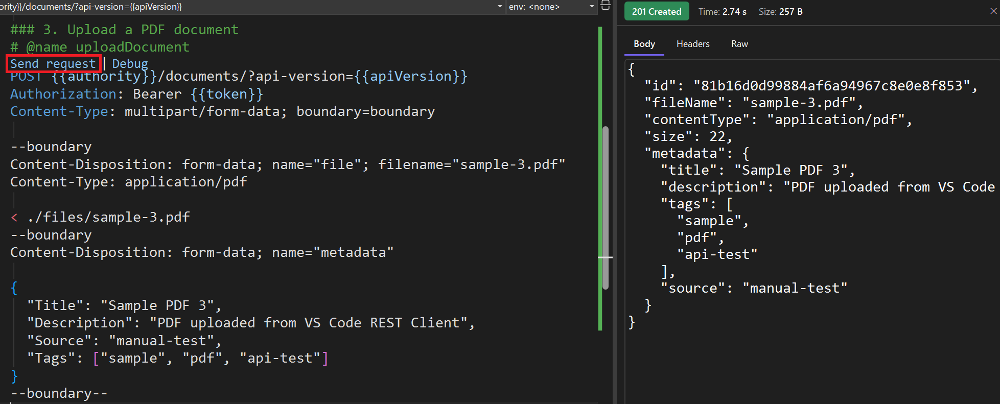

You must see the `201 Created` response with the uploaded document details and if you go inside your Azure SQL Database you should see the new document metadata row created:

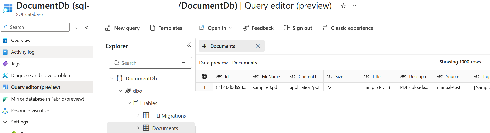

If you check your resource group, inside the Storage Account, inside **Containers** select the container named **documents** and you should see the new blob with the content of the uploaded file:

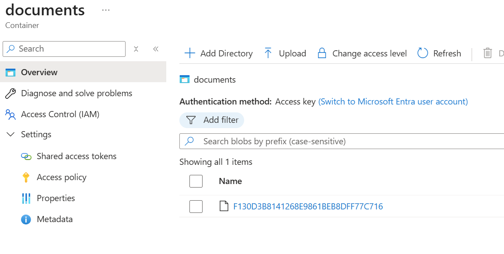

To upload new files you can modify the name `sample-1.pdf` to point to other files in the `files` folder.

<div class="task" data-title="Validation">

> A valid upload should return `201 Created` with a `DocumentDto` payload.
>
> Duplicate detection and advanced error handling are not implemented yet. That is the purpose of the next lab.

</div>

---

# Lab 5 - Upload Robustness

The upload happy path works, but real APIs need to be defensive. In this lab, you will reject invalid requests, detect duplicate content, clean up after dependency failures, and return predictable error responses.

You will keep the successful path from the previous lab, then add the defensive behavior around it: reject bad input early, avoid duplicate content, and clean up when one dependency succeeds but another fails.

## What You Will Learn

In this lab, you will:

- Validate multipart uploads.
- Reject empty files and unsupported content types.
- Detect duplicate documents using a content hash.
- Return `409 Conflict` for duplicate content.
- Clean up Blob Storage when SQL persistence fails.
- Use a resilience pipeline around database operations.
- Map dependency errors to clean HTTP responses.

## Files To Open

You only need to edit these files:

- `src/DocumentAPI/Validators/Documents/DocumentUploadValidator.cs`
- `src/DocumentAPI/Services/Documents/DocumentService.cs`
- `src/DocumentAPI/Endpoints/DocumentEndpoints.cs`

Exceptions, upload options, content type helpers, and the resilience pipeline are already provided.

## Understand The Resilience Pipeline

This lab introduces Polly, a .NET resilience library used to make dependency calls more reliable. Instead of writing retry loops by hand around every SQL Server call, the API centralizes the retry policy in `DocumentResiliencePipeline` and injects the resulting `ResiliencePipeline` into `DocumentService`.

The pipeline used in this workshop retries only failures that are usually temporary: transient `SqlException` values, `DbUpdateException` values caused by a transient SQL exception, and `TimeoutException`. It does not retry business errors such as duplicate documents, validation failures, or unsupported file types, because repeating those requests would not make them succeed.

The retry strategy uses exponential backoff with jitter. Exponential backoff waits longer after each failed attempt, while jitter adds a small random variation so many clients do not retry at exactly the same moment. This is a common pattern when a database is throttled, busy, restarting, or briefly unreachable.

In the service code, `_resiliencePipeline.ExecuteAsync(...)` means: run this database operation through the shared retry policy, pass the cancellation token through, and either return the result or rethrow the final exception if all retry attempts fail.

## Strengthen Upload Validation

Validation is deliberately outside the endpoint body. That keeps HTTP parsing separate from business rules and makes the rules easier to test in isolation later.

Open `DocumentUploadValidator.cs` and implement the upload rules inside the `Validate` method:

```csharp
if (file is null)
{
	return new RequestValidationFailure(new ProblemDetails
	{
		Status = StatusCodes.Status400BadRequest,
		Title = "Bad Request",
		Detail = "The file part is required.",
	});
}

if (metadata is null)
{
	return new RequestValidationFailure(new ProblemDetails
	{
		Status = StatusCodes.Status400BadRequest,
		Title = "Bad Request",
		Detail = "The metadata part is required.",
	});
}
```

Then add size and content type checks:

```csharp
if (file.Length <= 0)
{
	return new RequestValidationFailure(new ProblemDetails
	{
		Status = StatusCodes.Status400BadRequest,
		Title = "Bad Request",
		Detail = "The uploaded file cannot be empty.",
	});
}

if (file.Length > _options.Upload.MaxFileSizeBytes)
{
	return new RequestValidationFailure(new ProblemDetails
	{
		Status = StatusCodes.Status413PayloadTooLarge,
		Title = "Payload Too Large",
		Detail = $"The uploaded file exceeds the configured maximum size of {_options.Upload.MaxFileSizeBytes} bytes.",
	});
}

if (!DocumentContentTypes.IsSupported(file.ContentType))
{
	return new RequestValidationFailure(new ProblemDetails
	{
		Status = StatusCodes.Status400BadRequest,
		Title = "Bad Request",
		Detail = "Unsupported content type. Allowed values are PDF, TXT, DOC, and DOCX.",
	});
}
```

Return `null` when the request is valid.

```csharp
return null;
```

This keeps the calling code straightforward: a validation failure contains a `ProblemDetails` response, and `null` means the request can continue.

As you can see, the validation logic is entirely separate from the endpoint and service. That makes it easier to test and maintain as the rules evolve.

## Detect Duplicates In The Service

The content hash is a stable fingerprint of the file bytes. If two uploads have the same hash, the API can treat them as the same document content even if the file name is different.

Open `DocumentService.cs`. In the `UploadAsync` method, just after computing the content hash, check for an existing document with the same hash:

```csharp
// ... command.Content.Position = 0;

var existingDocument = await _resiliencePipeline.ExecuteAsync(
	async token => await _dbContext.Documents
		.AsNoTracking()
		.FirstOrDefaultAsync(document => document.ContentHash == hash, token),
	cancellationToken);

if (existingDocument is not null)
{
	stopwatch.Stop();
	_activityMonitor.TrackUploadDuplicate(
		existingDocument.Id,
		command.ContentType,
		command.Length,
		stopwatch.Elapsed.TotalMilliseconds);
	throw new DuplicateDocumentException(existingDocument.Id);
}
```

The duplicate lookup is a good candidate for the pipeline because it depends on SQL Server and can fail transiently. Keeping the retry wrapper around the database call also keeps the rest of the method focused on document behavior instead of infrastructure retry mechanics.

Wrap the storage and database writes in a `try` block and track whether the blob was uploaded. If the blob upload succeeds but SQL persistence fails, the service can remove the blob so the two dependencies do not drift apart.

```csharp
var documentId = Guid.NewGuid().ToString("N");
var blobUploaded = false;

try
{
	await _storage.SaveAsync(hash, command.Content, md5, cancellationToken);
	blobUploaded = true;

	// Previous code to create the entity, add it to the DbContext, then save with the resilience pipeline.
}
catch (DbUpdateException exception)
{
	if (blobUploaded)
	{
		await _storage.DeleteAsync(hash, cancellationToken);
	}

	_logger.LogError(exception, "Document upload failed due to a database error. ContentHash={ContentHash}", hash);
	throw;
}
```

That sketch shows the shape of the defensive code, but the final method needs a little more care:

- Save SQL changes through `_resiliencePipeline` so transient database failures can be retried.
- Log storage integrity and Azure Storage dependency failures before rethrowing.
- Recheck for a conflicting document after `DbUpdateException`, because another request may have inserted the same content hash first.
- Only delete the blob when SQL failed and no duplicate row exists.
- Convert the duplicate race into `DuplicateDocumentException` so the endpoint can return `409 Conflict`.

At the end of this section, your `UploadAsync` method should look like this:

```csharp
public async Task<DocumentDto> UploadAsync(DocumentUploadCommand command, CancellationToken cancellationToken)
{
	if (!command.Content.CanSeek)
	{
		throw new ArgumentException("The upload content stream must support seeking.", nameof(command));
	}

	var stopwatch = Stopwatch.StartNew();
	var md5 = command.Content.ComputeMd5();
	var hash = Convert.ToHexString(md5);
	command.Content.Position = 0;

	// Polly retries transient SQL failures before the upload is allowed to continue.
	var existingDocument = await _resiliencePipeline.ExecuteAsync(
		async token => await _dbContext.Documents
			.AsNoTracking()
			.FirstOrDefaultAsync(document => document.ContentHash == hash, token),
		cancellationToken);

	if (existingDocument is not null)
	{
		stopwatch.Stop();
		_activityMonitor.TrackUploadDuplicate(
			existingDocument.Id,
			command.ContentType,
			command.Length,
			stopwatch.Elapsed.TotalMilliseconds);
		throw new DuplicateDocumentException(existingDocument.Id);
	}

	var documentId = Guid.NewGuid().ToString("N");
	var blobUploaded = false;

	try
	{
		// Store the blob first so the SQL row never points to content that was not saved.
		await _storage.SaveAsync(hash, command.Content, md5, cancellationToken);
		blobUploaded = true;

		var (title, description, source, tags) = NormalizeMetadata(command.Metadata);
		var document = new Document
		{
			Id = documentId,
			FileName = command.FileName,
			ContentType = command.ContentType,
			Size = command.Length,
			Title = title,
			Description = description,
			Source = source,
			Tags = tags,
			ContentHash = hash,
			CreatedUtc = DateTimeOffset.UtcNow,
		};

		_dbContext.Documents.Add(document);
		// Save metadata through Polly because SQL persistence can fail transiently.
		await _resiliencePipeline.ExecuteAsync(
			async token => await _dbContext.SaveChangesAsync(token),
			cancellationToken);

		var documentDto = ToDocumentDto(document);
		stopwatch.Stop();
		_activityMonitor.TrackUploadSucceeded(documentDto, stopwatch.Elapsed.TotalMilliseconds);
		return documentDto;
	}
	catch (DocumentStorageIntegrityException exception)
	{
		stopwatch.Stop();
		_logger.LogError(
			exception,
			"Document upload failed due to storage integrity validation. ContentHash={ContentHash} FileName={FileName} ContentType={ContentType} SizeBytes={SizeBytes} DurationMs={DurationMs}",
			hash,
			command.FileName,
			command.ContentType,
			command.Length,
			stopwatch.Elapsed.TotalMilliseconds);
		throw;
	}
	catch (RequestFailedException exception)
	{
		stopwatch.Stop();
		_logger.LogError(
			exception,
			"Document upload failed due to storage dependency error. ContentHash={ContentHash} FileName={FileName} StorageStatus={StorageStatus} StorageErrorCode={StorageErrorCode} DurationMs={DurationMs}",
			hash,
			command.FileName,
			exception.Status,
			exception.ErrorCode,
			stopwatch.Elapsed.TotalMilliseconds);
		throw;
	}
	catch (DbUpdateException exception)
	{
		// If SQL failed because another request inserted the same hash, report a duplicate instead of deleting the shared blob.
		var conflictingDocument = await _resiliencePipeline.ExecuteAsync(
			async token => await _dbContext.Documents
				.AsNoTracking()
				.FirstOrDefaultAsync(document => document.ContentHash == hash, token),
			cancellationToken);

		if (conflictingDocument is null)
		{
			if (blobUploaded)
			{
				try
				{
					// Roll back only the blob created by this attempt when there is no duplicate owner.
					await _storage.DeleteAsync(hash, cancellationToken);
				}
				catch (Exception cleanupException) when (cleanupException is not OperationCanceledException)
				{
					_logger.LogWarning(
						cleanupException,
						"Document upload cleanup failed while deleting blob after a database error. ContentHash={ContentHash}",
						hash);
				}
			}

			stopwatch.Stop();
			_logger.LogError(
				exception,
				"Document upload failed due to a database error without duplicate match. ContentHash={ContentHash} FileName={FileName} DurationMs={DurationMs}",
				hash,
				command.FileName,
				stopwatch.Elapsed.TotalMilliseconds);
			throw;
		}

		stopwatch.Stop();
		_activityMonitor.TrackUploadDuplicate(
			conflictingDocument.Id,
			command.ContentType,
			command.Length,
			stopwatch.Elapsed.TotalMilliseconds);
		throw new DuplicateDocumentException(conflictingDocument.Id);
	}
	catch (Exception exception) when (exception is not OperationCanceledException)
	{
		stopwatch.Stop();
		_logger.LogError(
			exception,
			"Document upload failed unexpectedly. ContentHash={ContentHash} FileName={FileName} ContentType={ContentType} SizeBytes={SizeBytes} DurationMs={DurationMs}",
			hash,
			command.FileName,
			command.ContentType,
			command.Length,
			stopwatch.Elapsed.TotalMilliseconds);
		throw;
	}
}
```

<div class="tip" data-title="Duplicate races">

> The final solution rechecks for a conflicting content hash when SQL fails. That avoids deleting a blob that belongs to another request that uploaded the same content at the same time.

</div>

## Map Errors At The Endpoint

The service throws domain or dependency exceptions. The endpoint translates those exceptions into HTTP responses that clients can understand and handle consistently.

Open `DocumentEndpoints.cs` and wrap the service call:

```csharp
try
{
	var document = await documentService.UploadAsync(
		new DocumentUploadCommand(file.FileName, file.ContentType, fileStream, file.Length, metadataResult.Metadata!),
		cancellationToken);

	return Results.Json(document, statusCode: StatusCodes.Status201Created);
}
catch (DuplicateDocumentException exception)
{
	logger.LogWarning(exception, "Duplicate document upload rejected.");
	return Results.Problem(
		detail: "A document with the same content already exists.",
		statusCode: StatusCodes.Status409Conflict);
}
catch (DocumentStorageIntegrityException exception)
{
	logger.LogError(exception, "Document upload failed because storage integrity verification failed.");
	return Results.Problem(
		detail: "The document storage service reported a content integrity failure.",
		statusCode: StatusCodes.Status502BadGateway);
}
catch (RequestFailedException exception)
{
	logger.LogError(
		exception,
		"Document upload failed because the storage dependency is unavailable. StorageStatus={StorageStatus} StorageErrorCode={StorageErrorCode}",
		exception.Status,
		exception.ErrorCode);
	return Results.Problem(
		detail: "The document storage service is temporarily unavailable.",
		statusCode: StatusCodes.Status503ServiceUnavailable);
}
catch (DbUpdateException exception)
{
	logger.LogError(exception, "Document upload failed because the database dependency is unavailable.");
	return Results.Problem(
		detail: "The document database is temporarily unavailable.",
		statusCode: StatusCodes.Status503ServiceUnavailable);
}
catch (TimeoutException exception)
{
	logger.LogError(exception, "Document upload failed due to a dependency timeout.");
	return Results.Problem(
		detail: "A downstream dependency timed out while processing the request.",
		statusCode: StatusCodes.Status503ServiceUnavailable);
}
catch (Exception exception) when (exception is not OperationCanceledException)
{
	logger.LogError(exception, "Document upload failed due to an unexpected error.");
	return Results.Problem(
		detail: "An unexpected error occurred while processing the document request.",
		statusCode: StatusCodes.Status500InternalServerError);
}
```

Logging belongs at the boundary where the API translates the exception into HTTP; the service also logs the lower-level details it owns, such as the content hash and storage status code.

The important idea is consistency. Clients should not need to know whether the failure came from SQL Server, Blob Storage, or the document workflow internals.

## Run And Test The Upload

Start the project using the **Run** button in your Visual Studio or the following command lines:

```bash
dotnet run --project src/DocumentAPI/DocumentAPI.csproj
```

Open `src/http/requests.http` and send the upload request again. The first valid upload should still return `201 Created`.

Then send the same upload a second time to validate duplicate detection.

<div class="task" data-title="Validation">

> Try these scenarios from `src/http/requests.http`:
>
> - unsupported content type returns `400 Bad Request`
> - duplicate content returns `409 Conflict`

</div>

---

# Lab 6 - Download and Search Functionality

The API can now upload documents. In this lab, you will let clients retrieve stored content and search document metadata.

Search and download complete the core document workflow.

After this lab, a document can go through the complete lifecycle from upload to retrieval. The API becomes useful enough to validate with real end-to-end scenarios.

## What You Will Learn

In this lab, you will:

- Query document metadata by id.
- Open document content from Blob Storage.
- Return `404 Not Found` when metadata or content is missing.
- Search documents with optional filters.
- Expose download and search endpoints.

## Files To Open

You only need to edit these files:

- `src/DocumentAPI/Services/Documents/DocumentService.cs`
- `src/DocumentAPI/Endpoints/DocumentEndpoints.cs`

The search criteria and download result contracts are already provided.

## Implement Download In The Service

Download needs both dependencies: SQL tells you which blob to read and what content type to return, while Blob Storage provides the actual stream.

Open `DocumentService.cs` and implement `DownloadAsync`:

```csharp
var stopwatch = Stopwatch.StartNew();

var document = await _resiliencePipeline.ExecuteAsync(
	async token => await _dbContext.Documents
		.AsNoTracking()
		.FirstOrDefaultAsync(candidate => candidate.Id == id, token),
	cancellationToken);

if (document is null)
{
	_activityMonitor.TrackDownloadNotFound(id, stopwatch.Elapsed.TotalMilliseconds);
	return null;
}

var stream = await _storage.OpenReadAsync(document.ContentHash, cancellationToken);

if (stream is null)
{
	_activityMonitor.TrackDownloadNotFound(id, stopwatch.Elapsed.TotalMilliseconds);
	return null;
}

_activityMonitor.TrackDownloadSucceeded(document.Id, document.ContentType, document.Size, stopwatch.Elapsed.TotalMilliseconds);
return new DocumentContentResult(document.FileName, document.ContentType, stream);
```

This uses the same Polly pipeline introduced in the upload robustness lab. Only the SQL metadata lookup is wrapped because that is the dependency call covered by this retry policy; the Blob Storage read is handled separately by the storage service and the Azure SDK retry configuration.

Keep the same structure as upload: start the stopwatch, wrap the dependency calls in `try`, log dependency failures, and let the endpoint translate them into HTTP responses.

```csharp
var stopwatch = Stopwatch.StartNew();

try
{
	// Code you have done previously: Query metadata, open the blob stream, track success or not found, then return the result.
}
catch (DocumentStorageIntegrityException exception)
{
	stopwatch.Stop();
	_logger.LogError(
		exception,
		"Document download failed due to storage integrity validation. DocumentId={DocumentId} DurationMs={DurationMs}",
		id,
		stopwatch.Elapsed.TotalMilliseconds);
	throw;
}
catch (RequestFailedException exception)
{
	stopwatch.Stop();
	_logger.LogError(
		exception,
		"Document download failed due to storage dependency error. DocumentId={DocumentId} StorageStatus={StorageStatus} StorageErrorCode={StorageErrorCode} DurationMs={DurationMs}",
		id,
		exception.Status,
		exception.ErrorCode,
		stopwatch.Elapsed.TotalMilliseconds);
	throw;
}
catch (Exception exception) when (exception is not OperationCanceledException)
{
	stopwatch.Stop();
	_logger.LogError(
		exception,
		"Document download failed unexpectedly. DocumentId={DocumentId} DurationMs={DurationMs}",
		id,
		stopwatch.Elapsed.TotalMilliseconds);
	throw;
}
```

## Implement Search In The Service

The query starts with filters that SQL Server can handle efficiently. After loading the narrowed set, the service applies tag and free-text checks in memory to keep the lab code approachable.

Implement the metadata query in `QueryDocumentsAsync`:

```csharp
var query = _dbContext.Documents.AsNoTracking();

if (!string.IsNullOrWhiteSpace(criteria.Title))
{
	query = query.Where(document => document.Title == criteria.Title);
}

if (!string.IsNullOrWhiteSpace(criteria.ContentType))
{
	query = query.Where(document => document.ContentType == criteria.ContentType);
}

var documents = await query
	.OrderByDescending(document => document.CreatedUtc)
	.ToListAsync(cancellationToken);
```

Then apply filters that are easier to evaluate in memory:

```csharp
IEnumerable<Document> filtered = documents;

if (!string.IsNullOrWhiteSpace(criteria.Tag))
{
	filtered = filtered.Where(document =>
		document.Tags.Any(tag => string.Equals(tag, criteria.Tag, StringComparison.OrdinalIgnoreCase)));
}

if (!string.IsNullOrWhiteSpace(criteria.Query))
{
	filtered = filtered.Where(document => ContainsFreeText(document, criteria.Query));
}

return filtered.Select(ToDocumentDto).ToArray();
```

Then update `SearchAsync` so the query is executed through the resilience pipeline, tracked by the activity monitor, and logged when a dependency fails:

```csharp
var stopwatch = Stopwatch.StartNew();

try
{
	var documents = await _resiliencePipeline.ExecuteAsync(
		async token => await QueryDocumentsAsync(criteria, token),
		cancellationToken);

	_activityMonitor.TrackSearch(criteria, documents.Count, cacheHit: false);
	return documents;
}
catch (Exception exception) when (exception is not OperationCanceledException)
{
	stopwatch.Stop();
	_logger.LogError(
		exception,
		"Document search failed. DurationMs={DurationMs} HasQuery={HasQuery} HasTitleFilter={HasTitleFilter} HasTagFilter={HasTagFilter} HasContentTypeFilter={HasContentTypeFilter}",
		stopwatch.Elapsed.TotalMilliseconds,
		!string.IsNullOrWhiteSpace(criteria.Query),
		!string.IsNullOrWhiteSpace(criteria.Title),
		!string.IsNullOrWhiteSpace(criteria.Tag),
		!string.IsNullOrWhiteSpace(criteria.ContentType));
	throw;
}
```

Here again, Polly protects the SQL query, not the full endpoint. If the query keeps failing after the configured retry attempts, the exception still flows to the `catch` block so the service can log it and the endpoint can return a predictable error response.

The `cacheHit` value is always `false` in this lab. The next lab will add the cache and replace this direct query with cache-aware behavior.

## Expose The Endpoints

Open `DocumentEndpoints.cs` and implement the search handler:

The endpoint only builds a `DocumentSearchCriteria` object from query string values. This keeps filtering rules inside the service instead of spreading them through the HTTP layer.

```csharp
var documents = await documentService.SearchAsync(
	new DocumentSearchCriteria(query, title, tag, contentType),
	cancellationToken);

return Results.Ok(documents);
```

Wrap the service call so dependency failures become predictable API responses:

```csharp
var logger = loggerFactory.CreateLogger("DocumentEndpoints");

try
{
	var documents = await documentService.SearchAsync(
		new DocumentSearchCriteria(query, title, tag, contentType),
		cancellationToken);

	return Results.Ok(documents);
}
catch (DbUpdateException exception)
{
	logger.LogError(exception, "Document search failed because the database dependency is unavailable.");
	return Results.Problem(
		detail: "The document database is temporarily unavailable.",
		statusCode: StatusCodes.Status503ServiceUnavailable);
}
catch (TimeoutException exception)
{
	logger.LogError(exception, "Document search failed due to a dependency timeout.");
	return Results.Problem(
		detail: "A downstream dependency timed out while processing the request.",
		statusCode: StatusCodes.Status503ServiceUnavailable);
}
catch (Exception exception) when (exception is not OperationCanceledException)
{
	logger.LogError(exception, "Document search failed due to an unexpected error.");
	return Results.Problem(
		detail: "An unexpected error occurred while processing the document request.",
		statusCode: StatusCodes.Status500InternalServerError);
}
```

Then implement download:

`Results.File` streams the content back to the caller and keeps the original file name and content type. Range processing is enabled so clients can resume or partially read supported downloads.

```csharp
var document = await documentService.DownloadAsync(id, cancellationToken);

if (document is null)
{
	return Results.Problem(
		detail: "The requested document was not found.",
		statusCode: StatusCodes.Status404NotFound);
}

return Results.File(document.Content, document.ContentType, document.FileName, enableRangeProcessing: true);
```

Use the same boundary pattern for download errors:

```csharp
var logger = loggerFactory.CreateLogger("DocumentEndpoints");

try
{
	var document = await documentService.DownloadAsync(id, cancellationToken);

	if (document is null)
	{
		return Results.Problem(
			detail: "The requested document was not found.",
			statusCode: StatusCodes.Status404NotFound);
	}

	return Results.File(document.Content, document.ContentType, document.FileName, enableRangeProcessing: true);
}
catch (RequestFailedException exception)
{
	logger.LogError(
		exception,
		"Document download failed because the storage dependency is unavailable. StorageStatus={StorageStatus} StorageErrorCode={StorageErrorCode}",
		exception.Status,
		exception.ErrorCode);
	return Results.Problem(
		detail: "The document storage service is temporarily unavailable.",
		statusCode: StatusCodes.Status503ServiceUnavailable);
}
catch (DbUpdateException exception)
{
	logger.LogError(exception, "Document download failed because the database dependency is unavailable.");
	return Results.Problem(
		detail: "The document database is temporarily unavailable.",
		statusCode: StatusCodes.Status503ServiceUnavailable);
}
catch (TimeoutException exception)
{
	logger.LogError(exception, "Document download failed due to a dependency timeout.");
	return Results.Problem(
		detail: "A downstream dependency timed out while processing the request.",
		statusCode: StatusCodes.Status503ServiceUnavailable);
}
catch (Exception exception) when (exception is not OperationCanceledException)
{
	logger.LogError(exception, "Document download failed due to an unexpected error.");
	return Results.Problem(
		detail: "An unexpected error occurred while processing the document request.",
		statusCode: StatusCodes.Status500InternalServerError);
}
```

## Run And Test The Workflow

Start the project using the **Run** button in your Visual Studio or the following command lines:

```bash
dotnet run --project src/DocumentAPI/DocumentAPI.csproj
```

Open `src/http/requests.http` and run the document workflow requests in order:

1. Upload a document.
2. Search documents with the `Search documents` request.
3. Download the uploaded document with the `Download the last uploaded document` request.

The download request uses the id returned by the upload request, so send the upload request first.

<div class="task" data-title="Validation">

> Upload a document, search for it, then download its content from `src/http/requests.http`.
>
> Also try downloading an unknown id and confirm that the API returns `404 Not Found`.

</div>

---

# Lab 7 - Search Caching

Search is often called repeatedly with the same filters. In this lab, you will add in-memory caching to reduce repeated database work while keeping the API contract unchanged. In a real world scenario, the cache can be handled by an API Gateway in front of the API, but this lab focuses on the caching behavior itself.

The important part is not just caching; it is caching safely and invalidating results when new documents are uploaded.

## What You Will Learn

In this lab, you will:

- Register `IMemoryCache`.
- Create a deterministic cache key from search criteria.
- Cache search results with a configurable TTL.
- Track cache hit and cache miss behavior.
- Invalidate search results after upload.

## Files To Open

You only need to edit these files:

- `src/DocumentAPI/Services/Documents/DocumentService.cs`

The cache options and shared cache version service are already provided.

## Add Cache Around Search

Caching belongs around the service query, not inside the endpoint. This way every caller benefits from the same behavior, even if another endpoint or background process reuses the service later. It's also easier to test the caching behavior in isolation.

Open `DocumentService.cs` and update the entire `SearchAsync` with the code below:

```csharp
var stopwatch = Stopwatch.StartNew();

try
{
	var cacheKey = CreateCacheKey(_cacheVersion.Current, criteria);

	var cacheHit = _cache.TryGetValue(cacheKey, out IReadOnlyList<DocumentDto>? cachedDocuments) && cachedDocuments is not null;
	IReadOnlyList<DocumentDto> documents;

	if (cacheHit)
	{
		documents = cachedDocuments!;
	}
	else
	{
		documents = await _resiliencePipeline.ExecuteAsync(
			async token => await QueryDocumentsAsync(criteria, token),
			cancellationToken);
		_cache.Set(
			cacheKey,
			documents,
			new MemoryCacheEntryOptions
			{
				AbsoluteExpirationRelativeToNow = TimeSpan.FromSeconds(Math.Max(1, _options.Search.CacheTtlSeconds)),
			});
	}

	_activityMonitor.TrackSearch(criteria, documents.Count, cacheHit);

	return documents;
	// </lab>
}
catch (Exception exception) when (exception is not OperationCanceledException)
{
	stopwatch.Stop();
	_logger.LogError(
		exception,
		"Document search failed. DurationMs={DurationMs} HasQuery={HasQuery} HasTitleFilter={HasTitleFilter} HasTagFilter={HasTagFilter} HasContentTypeFilter={HasContentTypeFilter}",
		stopwatch.Elapsed.TotalMilliseconds,
		!string.IsNullOrWhiteSpace(criteria.Query),
		!string.IsNullOrWhiteSpace(criteria.Title),
		!string.IsNullOrWhiteSpace(criteria.Tag),
		!string.IsNullOrWhiteSpace(criteria.ContentType));
	throw;
}
```

As you can see the cache key is created from the search criteria and shared cache version. The service first checks for a cache hit and returns cached results if they exist. If not, it executes the query, stores the results in cache with a TTL, and returns them.

Notice that `_resiliencePipeline.ExecuteAsync(...)` is only called on a cache miss. A cache hit returns from memory and avoids the database completely, so there is no SQL dependency call for Polly to retry. On a miss, the database query still benefits from the same transient-failure retry policy used by upload and download.

The shared cache version is part of the key as you can see in the `CreateCacheKey` method. Incrementing it invalidates all previous search entries without having to enumerate cache keys.

## Invalidate After Upload

After a successful upload and database save, increment the cache version inside the `UploadAsync` method:

```csharp
// await _resiliencePipeline.ExecuteAsync(...);

_cacheVersion.Increment();

// var documentDto = ToDocumentDto(document);
```

<div class="tip" data-title="Why not remove cache entries one by one?">

> Search has many possible filter combinations. A versioned key is simpler and avoids tracking every possible cache key manually.

</div>

## Run And Test Search Caching

Start the project using the **Run** button in your Visual Studio or the following command lines:

```bash
dotnet run --project src/DocumentAPI/DocumentAPI.csproj
```

Open `src/http/requests.http`, upload a document, then send the `Search documents` request twice with the same query.

After that, upload another document and send the same search request again. The upload should invalidate previous search entries by incrementing the shared cache version.

<div class="task" data-title="Validation">

> Run the same search twice from `src/http/requests.http` and confirm that the second call uses the cached path.
>
> Upload a new document, search again, and confirm the cache is invalidated.
> You can check the time of the response to confirm caching behavior.

</div>

---

# Lab 8 - Health Endpoint

The API now depends on SQL Server and Blob Storage. In this lab, you will expose a health endpoint that reports whether those dependencies are reachable.

Health endpoints are used by humans, deployment systems, and monitoring tools. They should be simple, stable, and safe to call without authentication.

The endpoint is not meant to expose private diagnostics. It gives just enough information to know whether the API should receive traffic.

## What You Will Learn

In this lab, you will:

- Check database connectivity.
- Check Blob Storage connectivity.
- Re-evaluate dependency connectivity on a short cache interval instead of relying on a startup-only result.
- Return `Healthy`, `Degraded`, or `Unhealthy`.
- Include per-dependency details when the service is degraded.
- Keep `/health` anonymous.

## Files To Open

You only need to edit these files:

- `src/DocumentAPI/Services/DependencyInjection.cs`
- `src/DocumentAPI/Services/Health/DocumentHealthStatusService.cs`
- `src/DocumentAPI/Endpoints/HealthEndpoints.cs`

The health contracts, response models, and DI registration are already provided.

## Register The Health Service

Open `DependencyInjection.cs` and replace the health placeholder with the real implementation:

```csharp
services.AddScoped<IHealthStatusService, DocumentHealthStatusService>();
```

## Evaluate Dependency Health

A health endpoint should check the dependencies that make the API useful. Here, the service is healthy only when both SQL metadata and Blob content access are available.

The service includes a small in-memory cache around connectivity probes. This keeps `/health` inexpensive while still refreshing the dependency state periodically when the endpoint is called.

Open `DocumentHealthStatusService.cs` and implement `GetStatusAsync`:

```csharp
var storageHealthy = await GetCachedConnectivityAsync(
	StorageConnectivityCacheKey,
	token => _storage.CanConnectAsync(token),
	cancellationToken);
var databaseHealthy = await GetCachedConnectivityAsync(
	DatabaseConnectivityCacheKey,
	token => _dbContext.Database.CanConnectAsync(token),
	cancellationToken);
var checks = new Dictionary<string, HealthDependencyState>(StringComparer.Ordinal)
{
	["database"] = databaseHealthy
		? new HealthDependencyState(HealthStatus.Healthy)
		: new HealthDependencyState(HealthStatus.Unhealthy, "Database is unreachable."),
	["storage"] = storageHealthy
		? new HealthDependencyState(HealthStatus.Healthy)
		: new HealthDependencyState(HealthStatus.Unhealthy, "Storage is unreachable."),
};
```

Then return the overall state:

```csharp
if (storageHealthy && databaseHealthy)
{
	return new HealthStateResult(HealthStatus.Healthy, true, checks);
}

if (storageHealthy || databaseHealthy)
{
	return new HealthStateResult(HealthStatus.Degraded, true, checks);
}

return new HealthStateResult(HealthStatus.Unhealthy, false, checks);
```

## Map Health To HTTP

Open `HealthEndpoints.cs` and implement the response mapping inside the `GetHealthAsync` method:

The response has two layers: an HTTP status for infrastructure tools and a body that gives humans or dashboards more detail.

```csharp
var status = await healthStatusService.GetStatusAsync(cancellationToken);

if (!status.IsAvailable)
{
	return Results.Json(
		new UnhealthyStatus { Status = status.Status.ToString() },
		statusCode: StatusCodes.Status503ServiceUnavailable);
}

if (status.Status != HealthStatus.Degraded)
{
	return Results.Ok(new HealthyOrDegradedStatus { Status = status.Status.ToString() });
}
```

For degraded mode, include dependency details:

`Degraded` is useful when the service is still reachable but not fully healthy. It gives operators a clear signal without pretending everything is fine.

```csharp
return Results.Ok(new HealthyOrDegradedStatus
{
	Status = status.Status.ToString(),
	Checks = status.Checks.ToDictionary(
		pair => pair.Key,
		pair => new HealthCheckStatus
		{
			Status = pair.Value.Status.ToString(),
			Description = pair.Value.Description,
		},
		StringComparer.Ordinal),
});
```

<div class="tip" data-title="Why health is anonymous">

> Monitoring systems often call health endpoints without user credentials. Later, when JWT authentication is added, `/health` will remain public.

</div>

## Run And Test Health

Start the project using the **Run** button in your Visual Studio or the following command lines:

```bash
dotnet run --project src/DocumentAPI/DocumentAPI.csproj
```

Open `src/http/requests.http` and send the `Health` request.

<div class="task" data-title="Validation">

> Call `/health` from `src/http/requests.http` and confirm that it returns a status value.
>
> If one dependency is unavailable, the response should be `Degraded` and include dependency details.
> Tips: To be able to see the `Degraded` status, you can temporarily change a network settings, for instance by turning off the network access to the storage account if it's public. The health check will refresh every five minutes.

</div>

---

# Lab 9 - Unit Testing

You now have the main API behaviors in place. In this lab, you will add automated tests so the upload, search, download, duplicate detection, and edge cases can be validated repeatedly.

Each test should explain one behavior in code: what is arranged, what action happens, and what result proves the behavior is correct.

This lab focuses on `DocumentService` because it contains most of the document workflow rules. Endpoint tests are valuable too, but service tests are faster, easier to debug, and precise enough to protect the business behavior you implemented in the previous labs.

## What You Will Learn

In this lab, you will:

- Test `DocumentService` with EF Core InMemory.
- Use a fake document storage service.
- Verify search cache behavior.
- Verify upload happy path behavior.
- Verify duplicate detection.
- Verify missing and existing downloads.
- Cover endpoint behavior through the test factory.

## Files To Open

You only need to edit these files:

- `tests/DocumentAPI.Tests/DocumentServiceTests.cs`

The fake storage, package references, helper methods, and internal visibility setup are already provided. You will fill in the tests that use them.

## Understand The Test Helpers

The tests rely on a few helper types in the same file. You do not need to rewrite them, but it helps to understand why they exist.

`CreateDbContext` creates a fresh Entity Framework Core InMemory database for every test. The unique database name keeps tests isolated, so one test cannot accidentally reuse rows from another test.

`CreateService` builds a `DocumentService` with real workflow dependencies where useful and fake dependencies where external systems would make the test slow or fragile:

- `DocumentDbContext` is real but stored in memory for testing purposes, so Entity Framework queries and persistence are exercised.
- `RecordingStorage` replaces Blob Storage and records save/open behavior in memory.
- `RecordingActivityMonitor` replaces Application Insights and records telemetry calls in lists.
- `MemoryCache` and `DocumentSearchCacheVersion` are real, so cache behavior is actually tested.
- `ResiliencePipelineBuilder().Build()` creates an empty pipeline for tests; retry behavior itself is covered by configuration, while these tests focus on document workflow behavior.

`RecordingStorage` and `RecordingActivityMonitor` are test doubles. They are deliberately simple: they capture observable behavior without making assertions themselves. The test methods stay responsible for deciding what should be true.

## Test Search Cache Behavior

The cache test proves that repeated searches return the same result while reporting the second call as a cache hit. It uses Entity Framework Core InMemory for metadata and the recording activity monitor to inspect the business signal.

The setup creates one document directly in the database because this test is not about upload. It is about search behavior. By seeding only the metadata needed for the query, the test stays focused on the cache path.

Open `DocumentServiceTests.cs` and implement the `SearchUsesCacheBetweenCalls` method first:

```csharp
await using var dbContext = CreateDbContext();
dbContext.Documents.Add(new Document
{
	Id = "doc-1",
	FileName = "workshop-notes.txt",
	ContentType = "text/plain",
	Size = 11,
	Title = "Workshop Notes",
	Description = "Minimal API lab",
	Source = "unit-test",
	Tags = ["lab", "notes"],
	ContentHash = Encoding.UTF8.GetBytes("hello world").Md5ToHexString(),
	CreatedUtc = DateTimeOffset.UtcNow,
});
await dbContext.SaveChangesAsync();

var storage = new RecordingStorage();
var activityMonitor = new RecordingActivityMonitor();
var service = CreateService(dbContext, storage, activityMonitor);

var criteria = new DocumentSearchCriteria("workshop", null, null, "text/plain");

var firstResult = await service.SearchAsync(criteria, CancellationToken.None);
var secondResult = await service.SearchAsync(criteria, CancellationToken.None);

Assert.Single(firstResult);
Assert.Single(secondResult);
Assert.Equal(2, activityMonitor.SearchEvents.Count);
Assert.False(activityMonitor.SearchEvents[0].CacheHit);
Assert.True(activityMonitor.SearchEvents[1].CacheHit);
```

The two result assertions prove that caching does not change the API result. The activity monitor assertions prove the internal behavior changed: the first call queried normally, while the second call reused the cached result.

## Test Upload Happy Path

Open `DocumentServiceTests.cs` and implement the `UploadPersistsDocumentAndTracksSuccess` test:

This test stays close to the service boundary. It uses a real Entity Framework Core context, but replaces Blob Storage and telemetry with simple in-memory doubles.

The command represents the same data the endpoint would pass after parsing multipart form data. The test intentionally calls the service directly so a failure points to the upload workflow, not to HTTP parsing, routing, or authentication.

```csharp
await using var dbContext = CreateDbContext();
var storage = new RecordingStorage();
var activityMonitor = new RecordingActivityMonitor();
var service = CreateService(dbContext, storage, activityMonitor);

var command = new DocumentUploadCommand(
	"notes.txt",
	"text/plain",
	new MemoryStream(Encoding.UTF8.GetBytes("hello world")),
	Encoding.UTF8.GetByteCount("hello world"),
	new DocumentMetadataDto
	{
		Title = "Workshop Notes",
		Description = "Minimal API lab",
		Source = "unit-test",
		Tags = ["lab", "notes"],
	});

var document = await service.UploadAsync(command, CancellationToken.None);

var persisted = await dbContext.Documents.AsNoTracking().SingleAsync();

Assert.Equal(document.Id, persisted.Id);
Assert.Equal("Workshop Notes", persisted.Title);
Assert.Equal(1, storage.SaveCallCount);
Assert.Single(activityMonitor.UploadSucceededDocuments);
```

These assertions cover the three important outcomes of a successful upload: metadata was persisted, the binary content was saved once, and the business telemetry hook was called. Together, they protect the full happy path without needing a real Azure Storage account.

## Test Duplicate Content

Add a document with the same hash, then upload the same bytes again:

This test protects the rule introduced in the robustness lab. If someone changes upload later, the test will catch accidental duplicate storage. Update the `UploadWithDuplicateContentThrowsAndTracksDuplicate` test with the following code at the end:

The test inserts the existing row manually with the same MD5 content hash that the upload command will produce. That lets the service exercise its duplicate check before any blob write happens.

```csharp
await using var dbContext = CreateDbContext();

var duplicateBytes = Encoding.UTF8.GetBytes("same-content");
dbContext.Documents.Add(
	new Document
	{
		Id = "existing-doc",
		FileName = "existing.txt",
		ContentType = "text/plain",
		Size = duplicateBytes.Length,
		ContentHash = duplicateBytes.Md5ToHexString(),
		CreatedUtc = DateTimeOffset.UtcNow,
	});
await dbContext.SaveChangesAsync();

var storage = new RecordingStorage();
var activityMonitor = new RecordingActivityMonitor();
var service = CreateService(dbContext, storage, activityMonitor);

var command = new DocumentUploadCommand(
	"incoming.txt",
	"text/plain",
	new MemoryStream(duplicateBytes),
	duplicateBytes.Length,
	new DocumentMetadataDto());

var exception = await Assert.ThrowsAsync<DuplicateDocumentException>(() => service.UploadAsync(command, CancellationToken.None));

Assert.Equal("existing-doc", exception.ExistingDocumentId);
Assert.Equal(0, storage.SaveCallCount);
Assert.Single(activityMonitor.UploadDuplicateDocumentIds);
Assert.Equal("existing-doc", activityMonitor.UploadDuplicateDocumentIds[0]);
```

The exception assertion proves callers get the domain error used by the endpoint to return `409 Conflict`. The `SaveCallCount` assertion is just as important: duplicates must be rejected before writing the same bytes to storage again.

## Test Download Behavior

For a missing document:

Download has two important branches: the document exists or it does not. Testing both keeps the public `404` behavior reliable. Update the `DownloadReturnsNullWhenDocumentIsMissing` test with the following code at the end:

For the missing case, the database starts empty. The service should return `null` and track a not-found event instead of calling storage or throwing an exception.

```csharp
await using var dbContext = CreateDbContext();
var storage = new RecordingStorage();
var activityMonitor = new RecordingActivityMonitor();
var service = CreateService(dbContext, storage, activityMonitor);

var result = await service.DownloadAsync("missing", CancellationToken.None);

Assert.Null(result);
Assert.Single(activityMonitor.DownloadNotFoundDocumentIds);
Assert.Equal("missing", activityMonitor.DownloadNotFoundDocumentIds[0]);
```

This is the service-level behavior that the endpoint later translates into `404 Not Found`.

For an existing document seed storage and metadata, then read the returned stream, update the `DownloadReturnsContentWhenDocumentExists` test:

For the success case, both sides of the workflow must exist: SQL metadata points to a content hash, and fake storage contains bytes under that same hash. This mirrors the real download path without calling Azure Blob Storage.

```csharp
await using var dbContext = CreateDbContext();
var storage = new RecordingStorage();
var activityMonitor = new RecordingActivityMonitor();
var service = CreateService(dbContext, storage, activityMonitor);

var content = Encoding.UTF8.GetBytes("stored-content");
var contentHash = content.Md5ToHexString();
storage.Seed(contentHash, content);

dbContext.Documents.Add(
	new Document
	{
		Id = "doc-42",
		FileName = "doc-42.txt",
		ContentType = "text/plain",
		Size = content.Length,
		ContentHash = contentHash,
		CreatedUtc = DateTimeOffset.UtcNow,
	});
await dbContext.SaveChangesAsync();

var result = await service.DownloadAsync("doc-42", CancellationToken.None);

Assert.NotNull(result);
using var reader = new StreamReader(result!.Content);
var body = await reader.ReadToEndAsync();

Assert.Equal("stored-content", body);
Assert.Single(activityMonitor.DownloadSucceededDocumentIds);
Assert.Equal("doc-42", activityMonitor.DownloadSucceededDocumentIds[0]);
Assert.Empty(activityMonitor.DownloadNotFoundDocumentIds);
```

Reading the stream verifies that the returned content is not just non-null; it is the exact bytes saved in storage. The activity monitor assertions prove that the success path, not the not-found path, was recorded.


<div class="tip" data-title="Use Copilot for edge cases">

> Once the first test passes, ask Copilot to suggest additional edge cases around content type, metadata parsing, duplicate upload, and missing storage content.

</div>

## Run The Tests

You do not need to start the API project to run these tests. Visual Studio can discover and run them directly from the test project.

From Visual Studio:

1. Build the solution once so Visual Studio can discover the tests.
2. Open **Test > Test Explorer** from the top menu.
3. In Test Explorer, expand `DocumentAPI.Tests`.
4. Select **Run All Tests** to run the full test project.
5. To focus on one scenario, right-click a single test such as `UploadPersistsDocumentAndTracksSuccess` and select **Run**.

When a test fails, select it in Test Explorer to inspect the assertion message and stack trace. For this lab, most failures point either to `DocumentServiceTests.cs` or to one of the workflow methods in `DocumentService.cs`.

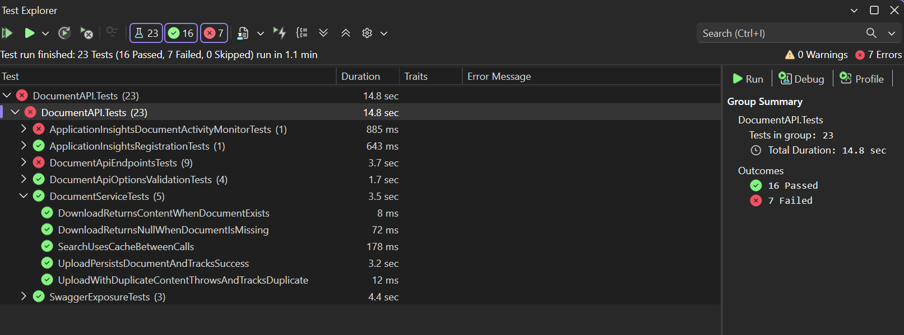

You can also run the same test project from the command line:

```bash
dotnet test tests/DocumentAPI.Tests/DocumentAPI.Tests.csproj
```

<div class="task" data-title="Validation">

> The test project should pass consistently.
>
> If you run the full test project, the first run may take longer while SQL Server Testcontainers prepares the container image for integration tests.

</div>

---

# Lab 10 - API Versioning

Your API now has real behavior. In this lab, you will introduce explicit API versioning so future changes can evolve without surprising clients.

The version will be read from the query string using `api-version=1.0`.

The goal is not to create a second version yet. The goal is to make version selection explicit before the API grows further.

## What You Will Learn

In this lab, you will:

- Register API versioning services.
- Configure query string version reading.
- Create a versioned endpoint group for `/documents`.
- Keep `/health` outside the versioned group.
- Generate Swagger documents per API version.

## Files To Open

You only need to edit these files:

- `src/DocumentAPI/Program.cs`
- `src/DocumentAPI/Endpoints/DocumentEndpoints.cs`

Swagger versioning helpers are already provided in the `OpenApi` folder.

## Register Versioning

Open `Program.cs` and add API versioning services:

Versioning makes the contract explicit. Instead of guessing which behavior a client expects, the API requires the caller to say which version it is using. Search for `TODO Lab 10` to find the right place to add this code:

```csharp
builder.Services
	.AddApiVersioning(options =>
	{
		options.AssumeDefaultVersionWhenUnspecified = false;
		options.ReportApiVersions = true;
		options.ApiVersionReader = new QueryStringApiVersionReader("api-version");
	})
	.AddApiExplorer(options =>
	{
		options.GroupNameFormat = "'v'V";
	});
```

Then register the Swagger configuration helpers:

```csharp
// After: builder.Services.AddEndpointsApiExplorer();
builder.Services.AddTransient<IConfigureOptions<SwaggerGenOptions>, ConfigureSwaggerOptions>();
```

Inside `AddSwaggerGen`, add the operation filter:

```csharp
options.OperationFilter<SwaggerDefaultValues>();
```

This will make sure the generated Swagger documents reflect the API versioning configuration, for instance by adding `api-version` as a required query parameter.

## Create A Versioned Documents Group

Grouping the document routes keeps versioning in one place. Future versions can add a new group without touching `/health` or unrelated operational endpoints.

Open `DocumentEndpoints.cs` and replace the simple route group with a versioned API builder:

```csharp
var documentGroup = endpoints.NewVersionedApi("Documents");
var v1Group = documentGroup.MapGroup("/documents")
	.WithTags("Documents")
	.HasApiVersion(new ApiVersion(1));
```

All document endpoints mapped on `v1Group` now require a supported API version.

<div class="tip" data-title="Health stays public">

> Do not move `/health` into this versioned group. Health checks are operational endpoints and should remain easy for monitors to call.

</div>

## Expose Swagger Per Version


Swagger should show the same versioned contract that clients use at runtime. When future versions appear, each one can have its own generated document.

Still in `Program.cs`, resolve the version provider in the `if (app.Environment.IsDevelopment())` block:

```csharp
var apiVersionDescriptionProvider = app.Services.GetRequiredService<IApiVersionDescriptionProvider>();
```

Then configure Swagger UI endpoints:

```csharp
app.UseSwaggerUI(options =>
{
	foreach (var description in apiVersionDescriptionProvider.ApiVersionDescriptions)
	{
		options.SwaggerEndpoint(
			$"/swagger/{description.GroupName}/swagger.json",
			$"DocumentAPI {description.GroupName.ToUpperInvariant()}");
	}

	options.RoutePrefix = "swagger";
});
```

## Run And Test Versioning

Start the project using the **Run** button in your Visual Studio or the following command lines:

```bash
dotnet run --project src/DocumentAPI/DocumentAPI.csproj
```

Open `src/http/requests.http` and make sure `@apiVersion` is set to `1`.

Call a versioned endpoint:

```txt
/documents/search?api-version=1.0
```

Then temporarily remove `?api-version={{apiVersion}}` from one document request and send it again, you will get
a 404 Not Found or change the value of the `apiVersion` parameter to `2` for instance and you will get a 400 Bad Request with a message about missing API version. This confirms that the API now requires explicit version selection.

<div class="task" data-title="Validation">

> Document endpoints should require `api-version=1.0` or `api-version=1`.
>
> `/health` should still be callable without an API version.

</div>

---

# Lab 11 - JWT Authentication

The document API now exposes useful operations. In this lab, you will protect those operations with JWT bearer authentication while keeping `/health` anonymous.

Authentication is configured from the options already provided in the starter.

You will protect the document workflow, not the whole application. Operational endpoints such as `/health` remain open so monitoring can keep working.

## What You Will Learn

In this lab, you will:

- Register JWT bearer authentication.
- Validate issuer, audience, signing key, and lifetime.
- Return a predictable `401 Unauthorized` response.
- Protect `/documents` endpoints.
- Keep Swagger usable with bearer tokens.

## Files To Open

You only need to edit these files:

- `src/DocumentAPI/Program.cs`
- `src/DocumentAPI/Endpoints/DocumentEndpoints.cs`

Authentication options, appsettings, and test token helpers are already provided.

## Register JWT Bearer Authentication

Open `Program.cs` and add JWT bearer authentication:

JWT bearer authentication lets the API validate a signed token without calling an external service for every request. The issuer, audience, and signing key define which tokens this API trusts.

Search for "TODO Lab 11: Register JWT bearer authentication and configure token validation" to find the right place to add this code:

```csharp
builder.Services
	.AddAuthentication(JwtBearerDefaults.AuthenticationScheme)
	.AddJwtBearer(options =>
	{
		options.RequireHttpsMetadata = documentApiOptions.Authentication.RequireHttpsMetadata;
		options.TokenValidationParameters = new TokenValidationParameters
		{
			ValidateIssuer = true,
			ValidIssuer = documentApiOptions.Authentication.Issuer,
			ValidateAudience = true,
			ValidAudience = documentApiOptions.Authentication.Audience,
			ValidateIssuerSigningKey = true,
			IssuerSigningKey = new SymmetricSecurityKey(Encoding.UTF8.GetBytes(documentApiOptions.Authentication.SigningKey)),
			ValidateLifetime = true,
			ClockSkew = TimeSpan.FromMinutes(1),
		};
	});
```

## Return A Clean 401 Response

Inside `AddJwtBearer`, configure `OnChallenge`:

The default challenge response can vary depending on middleware behavior. Returning `ProblemDetails` gives clients a predictable JSON shape.

```csharp
options.Events = new JwtBearerEvents
{
	OnChallenge = async context =>
	{
		context.HandleResponse();
		context.Response.StatusCode = StatusCodes.Status401Unauthorized;
		context.Response.ContentType = "application/problem+json";
		await context.Response.WriteAsJsonAsync(new ProblemDetails
		{
			Status = StatusCodes.Status401Unauthorized,
			Title = "Unauthorized",
			Detail = "Access is unauthorized.",
		});
	},
};
```

## Enable Authentication Middleware

Then enable the middleware before endpoint execution (`app.MapHealthEndpoints();`):

```csharp
app.UseAuthentication();
app.UseAuthorization();
```

## Protect Document Endpoints

Open `DocumentEndpoints.cs` and require authorization on the documents group:

Authorization is applied at the route group level so every current and future `/documents` endpoint inherits the same protection by default.

```csharp
var v1Group = documentGroup.MapGroup("/documents")
	.WithTags("Documents")
	.RequireAuthorization()
	.HasApiVersion(new ApiVersion(1));
```

If you open `HealthEndpoints.cs` you will see that the health endpoints has the `.AllowAnonymous()` configuration which allows them to be called without authentication.

## Add Bearer Support To Swagger

Go back to `Program.cs` inside `AddSwaggerGen`, add a bearer security definition at beginning of the configuration:

```csharp
var bearerSecurityScheme = new OpenApiSecurityScheme
{
	Name = "Authorization",
	Type = SecuritySchemeType.Http,
	Scheme = "bearer",
	BearerFormat = "JWT",
	In = ParameterLocation.Header,
	Description = "Provide a valid JWT bearer token.",
};

options.AddSecurityDefinition("Bearer", bearerSecurityScheme);
```

This does not authenticate anyone by itself. It only teaches Swagger UI how to send an `Authorization: Bearer ...` header when you test protected endpoints.

Then apply that scheme to the generated operations:

```csharp
options.AddSecurityRequirement(document => new OpenApiSecurityRequirement
{
	[new OpenApiSecuritySchemeReference("Bearer", hostDocument: document, externalResource: null)] = [],
});
```

Without the requirement, Swagger UI knows what a bearer token is, but the operations are not annotated as requiring it.

## Run And Test Authentication

Start the project using the **Run** button in your Visual Studio or the following command lines:

```bash
dotnet run --project src/DocumentAPI/DocumentAPI.csproj
```

Open `src/http/requests.http`. First send the `Health` request to confirm the API is running.

Then call the search endpoint without a token:

```txt
/documents/search?api-version=1.0
```

It should return `401 Unauthorized`.

To test the authenticated path, generate a valid JWT :


1. Open https://jwt.io/
2. In the Decoded section, update the Header.
3. Use this Header:
```json
{
	"alg": "HS256",
	"typ": "JWT"
}
```

4. Use this Payload template:

```json
{
	"iss": "DocumentAPI",
	"aud": "DocumentAPIClient",
	"sub": "lab-user",
	"name": "DocumentAPI User",
	"iat": 1735689600,
	"nbf": 1735689600,
	"exp": 2145916800,
	"jti": "lab-long-lived-token-001"
}
```

    Notes:
    - iat/nbf = 1735689600 (2025-01-01T00:00:00Z)
    - exp = 2145916800 (2038-01-01T00:00:00Z)
    - This is intentionally long-lived for testing purposes.

5. In Verify Signature:
- Set the secret to: `document-api-signing-key-to-randomly-generate`
- Make sure Secret base64 encoded is disabled

6. Copy the token from the Encoded section.

Paste it into the `@token` variable near the top of `src/http/requests.http`:

```http
@token=PASTE_VALID_JWT_HERE
```

Then uncomment the `Authorization: Bearer {{token}}` for each document request and send it again. With a valid token, the request should pass authentication and continue to the normal document endpoint behavior.

Add back the `Authorization: Bearer {{token}}` header on the document request and send it again. With a valid token, the request should pass authentication and continue to the normal document endpoint behavior.

<div class="task" data-title="Validation">

> Confirm that `/documents` requests in `src/http/requests.http` require a token.
>
> Confirm that `/health` still works anonymously.

</div>

---

# Lab 12 - Observability: Correlation ID and Application Insights

In the final lab, you will make the API easier to troubleshoot. You will add request correlation, HTTP logging, Application Insights telemetry, and business-level document activity monitoring.

The goal is to understand what happened, where it happened, and which document operation was involved.

You are adding signals that help during debugging and production support. Logs explain the request path, correlation connects events together, and custom telemetry explains the document operation.

## What You Will Learn

In this lab, you will:

- Read or generate an `X-Correlation-Id` header.
- Echo the correlation id in the response.
- Add the correlation id to logging scope and telemetry.
- Register Application Insights.
- Emit custom events and metrics for upload, search, and download.

## Files To Open

You only need to edit these files:

- `src/DocumentAPI/Observability/CorrelationIdMiddleware.cs`
- `src/DocumentAPI/Program.cs`
- `src/DocumentAPI/Services/Monitoring/ApplicationInsightsDocumentActivityMonitor.cs`

The telemetry initializer, monitoring options, and monitor interface are already provided.

## Add Correlation ID Middleware

Open `CorrelationIdMiddleware.cs` and implement `InvokeAsync`:

A correlation id is the thread you can follow through logs, HTTP responses, and telemetry. If the caller already sends one, the API keeps it; otherwise it creates one.

```csharp
var correlationId = ResolveCorrelationId(context.Request.Headers);
context.TraceIdentifier = correlationId;
context.Response.Headers[HeaderName] = correlationId;

using var _ = _logger.BeginScope(new Dictionary<string, object?>
{
	["CorrelationId"] = correlationId,
	["RequestPath"] = context.Request.Path.Value,
});

await _next(context);
```

The `_logger` field is an `ILogger<CorrelationIdMiddleware>` injected by ASP.NET Core. The generic type becomes the log category, which helps you know which component produced a message when logs are displayed in the console, Application Insights traces, or another logging provider.

`BeginScope` adds contextual properties to every log written while the request continues through the pipeline. Here, the correlation id and request path travel with the later endpoint and service logs, making it much easier to follow a single request across multiple components.

Then implement correlation id resolution:

```csharp
private static string ResolveCorrelationId(IHeaderDictionary headers)
{
	if (headers.TryGetValue(HeaderName, out StringValues values) && !StringValues.IsNullOrEmpty(values))
	{
		return values.ToString();
	}

	return Guid.NewGuid().ToString("N");
}
```

## Register Observability Services

Open `Program.cs` and add HTTP logging:

HTTP logs answer the operational questions first: which route was called, how long it took, and what status code came back. The correlation id makes those entries easy to join with deeper telemetry. Search for `TODO Lab 12: Register HTTP logging and include the correlation id header.` to find the right place to add this code:

```csharp
builder.Services.AddHttpLogging(options =>
{
	options.LoggingFields = HttpLoggingFields.RequestMethod
		| HttpLoggingFields.RequestPath
		| HttpLoggingFields.ResponseStatusCode
		| HttpLoggingFields.Duration;
	options.RequestHeaders.Add(CorrelationIdMiddleware.HeaderName);
	options.ResponseHeaders.Add(CorrelationIdMiddleware.HeaderName);
});
```

Application Insights receives the platform telemetry, while the telemetry initializer enriches it with request context such as the correlation id. Just after `builder.Services.AddApplicationInsightsTelemetry();` Register Application Insights:

```csharp
var applicationInsightsOptions = documentApiOptions.ApplicationInsights;
var applicationInsightsConnectionString = applicationInsightsOptions.Enabled
	? ResolveApplicationInsightsConnectionString(builder.Configuration, applicationInsightsOptions)
	: null;

if (applicationInsightsOptions.Enabled && string.IsNullOrWhiteSpace(applicationInsightsConnectionString))
{
	throw new InvalidOperationException("Application Insights is enabled but no connection string was configured.");
}

builder.Services.AddHttpContextAccessor();
builder.Services.AddSingleton<ITelemetryInitializer, DocumentApiTelemetryInitializer>();
builder.Services.AddApplicationInsightsTelemetry(options =>
{
	options.ConnectionString = applicationInsightsConnectionString;
	options.EnableAdaptiveSampling = applicationInsightsOptions.EnableAdaptiveSampling;
});
```

Then enable the middleware before `app.UseAuthentication();`:

```csharp
app.UseHttpLogging();
app.UseMiddleware<CorrelationIdMiddleware>();
```

## Emit Business Telemetry

You can create custom events and metrics in Application Insights to understand the business operations happening in the API. If you remember from the previous labs, you use the `DocumentActivityMonitor` interface in the service methods to track document operations. The implementation of that interface is where you will emit the custom telemetry. Let's do it know.

Open `ApplicationInsightsDocumentActivityMonitor.cs` and implement the `TrackSearch` method:

In these methods, `_logger` and `_telemetryClient` are complementary. The logger writes human-readable diagnostic traces with named properties, while the telemetry client emits custom events and metrics that are easier to chart and aggregate. Keeping both means you can read the story of one request and also measure behavior across many requests.

```csharp
_logger.LogInformation(
	"Document search completed. CacheHit={CacheHit} ResultCount={ResultCount} HasQuery={HasQuery} HasTitleFilter={HasTitleFilter} HasTagFilter={HasTagFilter} HasContentTypeFilter={HasContentTypeFilter}",
	cacheHit,
	resultCount,
	!string.IsNullOrWhiteSpace(criteria.Query),
	!string.IsNullOrWhiteSpace(criteria.Title),
	!string.IsNullOrWhiteSpace(criteria.Tag),
	!string.IsNullOrWhiteSpace(criteria.ContentType));

_telemetryClient.TrackEvent(
	"Documents.Search.Completed",
	new Dictionary<string, string>
	{
		["CacheHit"] = cacheHit.ToString(),
		["HasQuery"] = (!string.IsNullOrWhiteSpace(criteria.Query)).ToString(),
		["HasTitleFilter"] = (!string.IsNullOrWhiteSpace(criteria.Title)).ToString(),
		["HasTagFilter"] = (!string.IsNullOrWhiteSpace(criteria.Tag)).ToString(),
		["HasContentTypeFilter"] = (!string.IsNullOrWhiteSpace(criteria.ContentType)).ToString(),
	},
	new Dictionary<string, double>
	{
		["ResultCount"] = resultCount,
	});
```

Same thing for the `TrackUploadSucceeded` method:

```csharp
Use the same pattern for upload and download:

```csharp
 _logger.LogInformation(
	"Document upload completed. DocumentId={DocumentId} ContentType={ContentType} SizeBytes={SizeBytes} DurationMs={DurationMs}",
	document.Id,
	document.ContentType,
	document.Size,
	durationMs);

_telemetryClient.TrackEvent(
	"Documents.Upload.Completed",
	new Dictionary<string, string>
	{
		["DocumentId"] = document.Id,
		["ContentType"] = document.ContentType ?? string.Empty,
	},
	new Dictionary<string, double>
	{
		["SizeBytes"] = document.Size ?? 0,
		["DurationMs"] = durationMs,
	});

_telemetryClient.TrackMetric(new MetricTelemetry("Documents.Upload.SizeBytes", document.Size ?? 0));
_telemetryClient.TrackMetric(new MetricTelemetry("Documents.Upload.DurationMs", durationMs));
```

For the `TrackUploadDuplicate` method:

```csharp
_logger.LogWarning(
		"Duplicate document upload rejected. ExistingDocumentId={ExistingDocumentId} ContentType={ContentType} SizeBytes={SizeBytes} DurationMs={DurationMs}",
		existingDocumentId,
		contentType,
		sizeBytes,
		durationMs);

_telemetryClient.TrackEvent(
	"Documents.Upload.Duplicate",
	new Dictionary<string, string>
	{
		["ExistingDocumentId"] = existingDocumentId,
		["ContentType"] = contentType,
	},
	new Dictionary<string, double>
	{
		["SizeBytes"] = sizeBytes,
		["DurationMs"] = durationMs,
	});

_telemetryClient.TrackMetric(new MetricTelemetry("Documents.Upload.DuplicateCount", 1));
```

For the `TrackDownloadSucceeded` method:
```csharp
_logger.LogInformation(
	"Document download completed. DocumentId={DocumentId} ContentType={ContentType} SizeBytes={SizeBytes} DurationMs={DurationMs}",
	documentId,
	contentType,
	sizeBytes,
	durationMs);

_telemetryClient.TrackEvent(
	"Documents.Download.Completed",
	new Dictionary<string, string>
	{
		["DocumentId"] = documentId,
		["ContentType"] = contentType,
	},
	new Dictionary<string, double>
	{
		["SizeBytes"] = sizeBytes,
		["DurationMs"] = durationMs,
	});

_telemetryClient.TrackMetric(new MetricTelemetry("Documents.Download.SizeBytes", sizeBytes));
_telemetryClient.TrackMetric(new MetricTelemetry("Documents.Download.DurationMs", durationMs));
```

And for the `TrackDownloadNotFound` method:

```csharp
_logger.LogWarning(
	"Document download returned no content. DocumentId={DocumentId} DurationMs={DurationMs}",
	documentId,
	durationMs);

_telemetryClient.TrackEvent(
	"Documents.Download.NotFound",
	new Dictionary<string, string>
	{
		["DocumentId"] = documentId,
	},
	new Dictionary<string, double>
	{
		["DurationMs"] = durationMs,
	});

_telemetryClient.TrackMetric(new MetricTelemetry("Documents.Download.NotFoundCount", 1));
```

<div class="tip" data-title="Telemetry is useful when it is structured">

> Prefer named properties like `DocumentId`, `ContentType`, `DurationMs`, and `CacheHit` over long free-text messages. They are easier to query later.

</div>

## Run And Test Observability

Start the project using the **Run** button in your Visual Studio or the following command lines:

```bash
dotnet run --project src/DocumentAPI/DocumentAPI.csproj
```

Open `src/http/requests.http` and send a request with a correlation id header:

```txt
X-Correlation-Id: workshop-correlation-id
```

<div class="task" data-title="Validation">

> Confirm that the response includes the same `X-Correlation-Id` value.
>
> If Application Insights is configured, run the upload, search, and download requests from `src/http/requests.http`, then inspect the emitted custom events and metrics.

</div>

Inside Application Insights, you can see multiple signals:

In the overview, you can see the requests, failures, server response time:

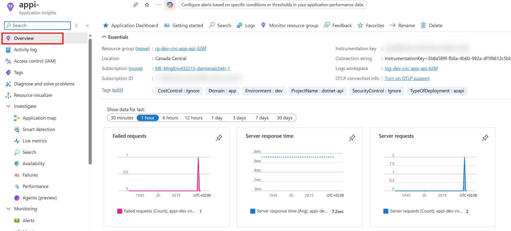

After a few calls, you will be able to see the Application Map with the API dependencies:

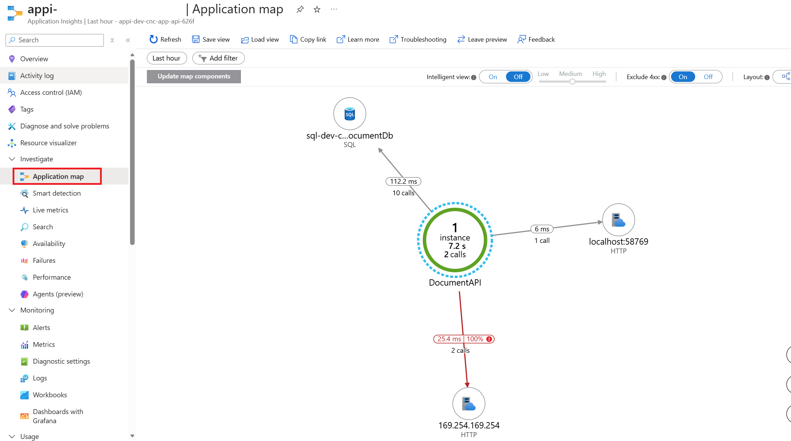

With your application running from your machine, open the Live Metrics section and get more real-time insights. You can see incoming requests, failed requests, and performance counters:

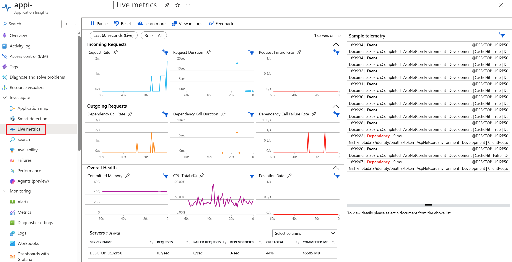

Inside the Failure section, you can see the failed requests with their properties and traces:

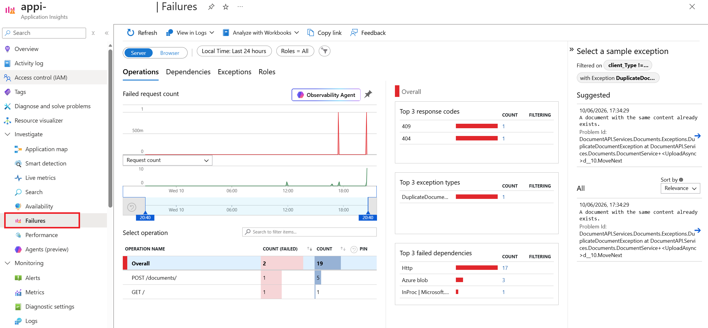

If you click on a specific request, you will see the details of that request and the exception raised:

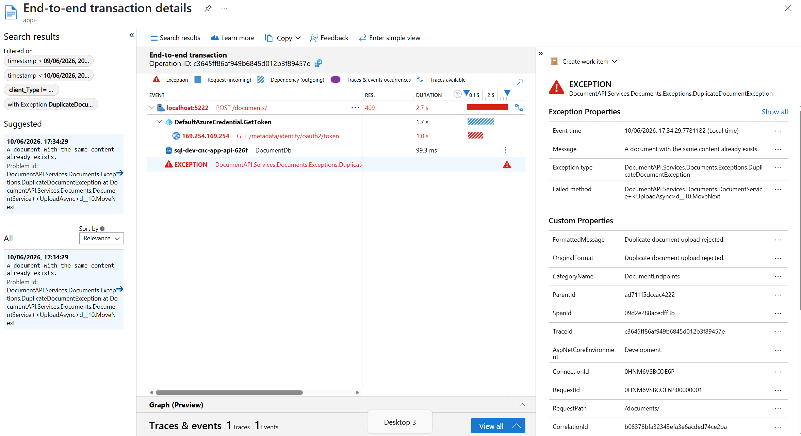

Inside performance, you can see the performance of your dependencies and operations:

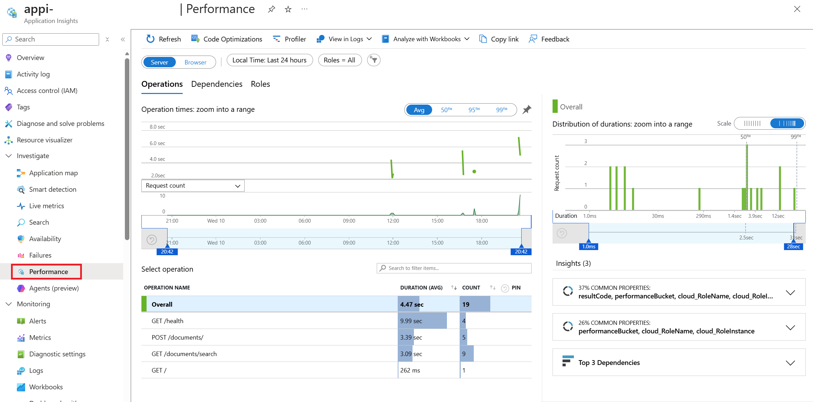

Finally, you can also query the custom events and metrics you emitted by going to the Logs section and running queries like this one to see the search events:

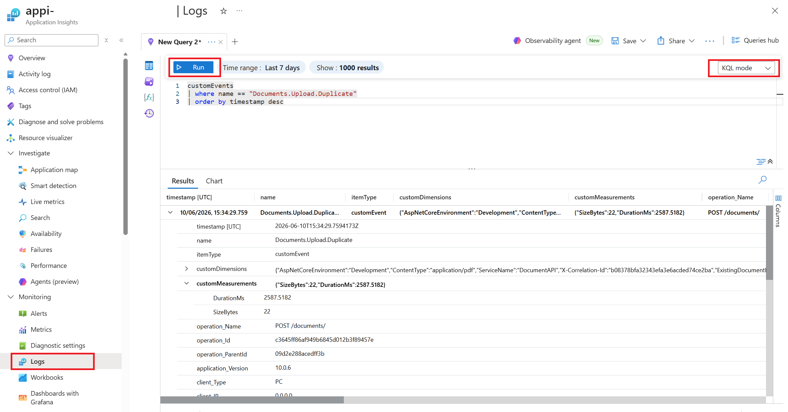

Select **KQL Mode** in the top right corner of the query editor. Type your query as described below select it and click on the **Run** button.

For duplicate upload copy/paste the following query and run it:

```bash
customEvents
| where name == "Documents.Upload.Duplicate"
| order by timestamp desc
```

For message logger copy/paste the following query and run it:

```bash
traces
| where message has "Duplicate document upload rejected"
| project timestamp, severityLevel, message, CorrelationId=tostring(customDimensions.["X-Correlation-Id"]), ServiceName=tostring(customDimensions.ServiceName), operation_Id
| order by timestamp desc
```

For metrics copy/paste the following query and run it:

```bash
customMetrics
| where name == "Documents.Upload.DuplicateCount"
| summarize Total=sum(value) by bin(timestamp, 15m)
```

Feel free to explore the other custom events and metrics you emitted.

---

## Bonus Lab: Implementing Document Deletion

In this bonus lab, you will implement the ability to delete a document from the API. This will involve creating a new endpoint, implementing the corresponding service method, and ensuring that the document is removed from both storage and metadata.

Use GitHub Copilot to assist you in writing the code using the agent mode and the model of your choice. You can ask Copilot to generate code snippets, suggest improvements, or help you with any part of the implementation.

Validate your development by adding the new endpoint to the `request.http` file and add unit tests to cover the deletion functionality.

---

## Closing the workshop

Once you're done with this lab you can delete the resource group you created at the beginning.

To do so, click on **Delete resource group** in the Azure Portal to delete all the resources at once. The following Az-Cli command can also be used to delete the resource group:

```bash
# Delete the resource group with all the resources
az group delete --name <resource-group>
```

