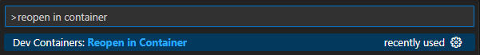

# Product Hands-on Lab - Modern .NET API

Welcome to this hands-on lab! In this workshop, you will learn how to build a modern .NET API using ASP.NET Core Minimal APIs, Azure SQL Database, Azure Blob Storage, and Application Insights. You will implement a document management API that allows users to upload, search, and download documents while following best practices for API design, security, and observability.

---

## Prerequisites

Before starting this lab, be sure to set your Azure environment :

- An Azure Subscription with the **Contributor** role to create and manage the labs' resources and deploy the infrastructure as code
- Register the Azure providers on your Azure Subscription if not done yet: `Microsoft.Storage`, `Microsoft.Sql`, `Microsoft.Insights`, `Microsoft.OperationalInsights`.

To retrieve the lab content :

- A GitHub account (Free, Team or Enterprise)
- Create a [fork][repo-fork] of the repository from the **main** branch to help you keep track of your changes

2 development options are available:
  - 🥈 Local Devcontainer
  - 🥉 Local Dev Environment with all the prerequisites detailed below

### 🥈 : Using a local Devcontainer

This repo comes with a Devcontainer configuration that will let you open a fully configured dev environment from your local Visual Studio Code, while still being completely isolated from the rest of your local machine configuration : No more dependancy conflict.
Here are the required tools to do so :

- [Git client][git-client]
- [Docker Desktop][docker-desktop] running
- [Visual Studio Code][vs-code] installed on your machine

Start by cloning the repository you just forked on your local Machine and open the local folder in Visual Studio Code.
Once you have cloned the repository locally, make sure Docker Desktop is up and running and open the cloned repository in Visual Studio Code.  

You will be prompted to open the project in a Dev Container. Click on `Reopen in Container`.

If you are not prompted by Visual Studio Code, you can open the command palette (`Ctrl + Shift + P`) and search for `Reopen in Container` and select it:



Once you have reopened the project in the Dev Container, Visual Studio Code will start building the container image based on the `.devcontainer` folder. This process might take a few minutes, but it only happens the first time you open the project in a Dev Container.

### 🥉 : Using your own local environment

The following tools and access will be necessary to run the lab on a local environment:  

- [Git client][git-client]
- [Visual Studio][visual-studio] installed
- [Azure CLI][az-cli-install] installed on your machine
- [Terraform][download-terraform] installed on your machine (to deploy the infrastructure as code)
- [Docker Desktop][docker-desktop]

Once you have set up your local environment, you can clone the repository you just forked on your machine, and open the solution in Visual Studio.

### Sign in to Azure

> - Log into your Azure subscription in your environment using Azure CLI and on the [Azure Portal][az-portal] using your credentials.
> - Register the Azure providers on your Azure Subscription if not done yet: `Microsoft.Storage`, `Microsoft.Sql`, `Microsoft.Insights`, `Microsoft.OperationalInsights`.

```bash
# Login to Azure : 
# --tenant : Optional | In case your Azure account has access to multiple tenants

# Option 1 : Local Environment 
az login --tenant <yourtenantid or domain.com>
# Option 2 : Github Codespace : you might need to specify --use-device-code parameter to ease the az cli authentication process
az login --use-device-code --tenant <yourtenantid or domain.com>

# Display your account details
az account show
# Select your Azure subscription
az account set --subscription <subscription-id>

# Register the following Azure providers if they are not already
# Azure Storage
az provider register --namespace 'Microsoft.Storage'
# Azure SQL
az provider register --namespace 'Microsoft.Sql'
# Azure Monitor
az provider register --namespace 'Microsoft.Insights'
# Azure Log Analytics
az provider register --namespace 'Microsoft.OperationalInsights'
```

### Deploy the infrastructure

First, you need to initialize the terraform infrastructure by running the following command:

```bash
# Run the following line which will dynamically set the subscription ID as an environment variable:
# On Bash or Zsh:
export ARM_SUBSCRIPTION_ID=$(az account show --query id -o tsv)
# On Windows PowerShell:
$env:ARM_SUBSCRIPTION_ID = (az account show --query id -o tsv)

# Initialize terraform
cd infra && terraform init
```

Then run the following command to deploy the infrastructure:

```bash
# Apply the deployment directly
terraform apply -auto-approve
```

The deployment should take around 5 minutes to complete.

[az-cli-install]: https://learn.microsoft.com/en-us/cli/azure/install-azure-cli
[az-portal]: https://portal.azure.com
[visual-studio]: https://visualstudio.microsoft.com/
[docker-desktop]: https://www.docker.com/products/docker-desktop/
[repo-fork]: https://github.com/damienaicheh/hands-on-lab-agent-framework-on-azure/fork
[git-client]: https://git-scm.com/downloads
[github-account]: https://github.com/join
[download-terraform]: https://developer.hashicorp.com/terraform/install

---

# Lab 1 - Skeleton + Swagger

Welcome to the first lab of the Document API workshop. In this step, you will expose an OpenAPI document for the Minimal API and make the first endpoints visible in Swagger UI.

The goal is intentionally small: understand where the API is wired, then add just enough metadata so the application becomes easy to discover and test.

## What You Will Learn

In this lab, you will:

- Explore the `DocumentAPI` Minimal API entry point.
- Register the ASP.NET Core endpoint explorer and Swagger generator.
- Enable Swagger UI in the development environment.
- Add the first metadata on document endpoints.
- Verify that the OpenAPI document is generated.

## Files To Open

You only need to edit these files:

- `src/DocumentAPI/Program.cs`
- `src/DocumentAPI/Endpoints/DocumentEndpoints.cs`

The health endpoint, DTOs, packages, and starter tests are already provided.

<div class="tip" data-title="Keep the scope small">

> This lab is about API discoverability. Do not implement upload, search, download, SQL, or storage yet. Those parts are intentionally incomplete in the starter.

</div>

## Register Swagger Services

Open `Program.cs` and find the Lab 1 TODO around Swagger services.

Replace it with:

```csharp
builder.Services.AddEndpointsApiExplorer();
builder.Services.AddSwaggerGen(options =>
{
	var xmlFileName = $"{Assembly.GetExecutingAssembly().GetName().Name}.xml";
	var xmlPath = Path.Combine(AppContext.BaseDirectory, xmlFileName);

	if (File.Exists(xmlPath))
	{
		options.IncludeXmlComments(xmlPath, includeControllerXmlComments: true);
	}
});
```

`AddEndpointsApiExplorer` lets Minimal API endpoints appear in OpenAPI. `AddSwaggerGen` creates the Swagger document.

## Enable Swagger UI

Still in `Program.cs`, find the Lab 1 TODO inside the development block and add:

```csharp
app.UseSwagger();
app.UseSwaggerUI();
```

Swagger UI stays development-only so the runtime pipeline remains clean outside local development.

## Add Endpoint Metadata

Open `DocumentEndpoints.cs` and enrich the document routes with OpenAPI metadata:

```csharp
v1Group.MapGet("/search", SearchAsync)
	.WithName("Documents_search")
	.Produces<IReadOnlyList<DocumentDto>>(StatusCodes.Status200OK)
	.ProducesProblem(StatusCodes.Status400BadRequest)
	.ProducesProblem(StatusCodes.Status500InternalServerError);

v1Group.MapPost("/", UploadAsync)
	.WithName("Documents_upload")
	.Accepts<IFormFile>("multipart/form-data")
	.Produces<DocumentDto>(StatusCodes.Status201Created)
	.ProducesProblem(StatusCodes.Status400BadRequest);

v1Group.MapGet("/{id}/content", DownloadAsync)
	.WithName("Documents_download")
	.Produces(StatusCodes.Status200OK)
	.ProducesProblem(StatusCodes.Status404NotFound);
```

You will add more response codes later as the API becomes more complete.

## Run The API

Build the project:

```bash
dotnet build src/DocumentAPI/DocumentAPI.csproj
```

Then run it:

```bash
dotnet run --project src/DocumentAPI/DocumentAPI.csproj
```

Open Swagger UI at:

```txt
https://localhost:<port>/swagger
```

<div class="task" data-title="Validation">

> Confirm that Swagger UI opens and shows the document endpoints.
>
> The handlers can still throw `NotImplementedException`; that is expected at this stage.

</div>

---

# Lab 2 - SQL Database and Dependency Injection

In this lab, you will add SQL Server persistence for document metadata. The API will still not upload documents end-to-end, but the persistence layer will be ready for the next labs.

The starter already provides the `Document` entity, database options, EF Core mapping, migration files, and Azure SQL authentication helper. Your job is to connect those pieces through `DocumentDbContext` and dependency injection.

## What You Will Learn

In this lab, you will:

- Expose a `DbSet<Document>` from the EF Core context.
- Apply entity configurations from the current assembly.
- Register `DocumentDbContext` in the application container.
- Apply pending migrations when the application starts.
- Build a SQL Server connection string from strongly typed options.

## Files To Open

You only need to edit these files:

- `src/DocumentAPI/Persistence/DocumentDbContext.cs`
- `src/DocumentAPI/Services/DependencyInjection.cs`

The entity, options, mappings, and migration are already provided.

## Complete The DbContext

Open `DocumentDbContext.cs` and expose the document metadata set:

```csharp
public DbSet<Document> Documents => Set<Document>();
```

Then apply the EF Core configurations:

```csharp
protected override void OnModelCreating(ModelBuilder modelBuilder)
{
	base.OnModelCreating(modelBuilder);
	modelBuilder.ApplyConfigurationsFromAssembly(typeof(DocumentDbContext).Assembly);
}
```

This keeps table mapping, indexes, and column details in `DocumentConfiguration.cs`.

## Register SQL Server

Open `DependencyInjection.cs` and register the context inside `AddDocumentServices`:

```csharp
services.AddDbContext<DocumentDbContext>(builder => ConfigureDatabase(builder, options.Database));
```

Then implement startup migration:

```csharp
public static async Task InitializeDocumentDatabaseAsync(
	this IServiceProvider services,
	CancellationToken cancellationToken = default)
{
	using var scope = services.CreateScope();
	var dbContext = scope.ServiceProvider.GetRequiredService<DocumentDbContext>();

	await dbContext.Database.MigrateAsync(cancellationToken);
}
```

<div class="tip" data-title="Why migrations at startup?">

> For this hands-on lab, applying migrations at startup keeps the environment simple. In production, database changes are usually deployed by a release pipeline.

</div>

## Configure The SQL Provider

Add the provider configuration:

```csharp
private static void ConfigureDatabase(DbContextOptionsBuilder builder, DocumentDatabaseOptions databaseOptions)
{
	if (string.IsNullOrWhiteSpace(databaseOptions.ServiceUri))
	{
		throw new InvalidOperationException("DocumentApi:Database:ServiceUri must be configured.");
	}

	if (string.IsNullOrWhiteSpace(databaseOptions.DatabaseName))
	{
		throw new InvalidOperationException("DocumentApi:Database:DatabaseName must be configured.");
	}

	var credential = new DefaultAzureCredential();
	builder
		.UseSqlServer(CreateSqlConnectionStringFromSettings(databaseOptions.ServiceUri, databaseOptions.DatabaseName))
		.AddInterceptors(new AzureSqlAuthenticationInterceptor(credential));
}
```

Now add the helper that converts the configured server URI into a SQL connection string:

```csharp
private static string CreateSqlConnectionStringFromSettings(string serviceUri, string databaseName)
{
	var uri = new Uri(serviceUri, UriKind.Absolute);
	var builder = new SqlConnectionStringBuilder
	{
		DataSource = uri.IsDefaultPort ? uri.Host : $"{uri.Host},{uri.Port}",
		InitialCatalog = Uri.UnescapeDataString(databaseName),
		Encrypt = true,
		TrustServerCertificate = false,
		ConnectTimeout = 30,
	};

	return builder.ConnectionString;
}
```

## Build The Project

```bash
dotnet build src/DocumentAPI/DocumentAPI.csproj
```

<div class="task" data-title="Validation">

> The project should build successfully.
>
> You now have SQL metadata persistence registered, even though upload is not complete yet.

</div>

---

# Lab 3 - Blob Storage Integration

In the previous lab, you wired SQL Server for metadata. Now you will add Azure Blob Storage for the binary content of uploaded documents.

The API keeps metadata and content separated: SQL Server stores searchable properties, while Blob Storage stores the file bytes.

## What You Will Learn

In this lab, you will:

- Create a `BlobServiceClient` with `DefaultAzureCredential`.
- Resolve the configured blob container.
- Save content to Blob Storage.
- Open document content for download.
- Delete content when cleanup is required.
- Register the storage service in dependency injection.

## Files To Open

You only need to edit these files:

- `src/DocumentAPI/Services/Storage/AzureBlobDocumentStorageService.cs`
- `src/DocumentAPI/Services/DependencyInjection.cs`

The storage interface, options, packages, and configuration keys are already provided.

## Create The Blob Client

Open `AzureBlobDocumentStorageService.cs` and implement the constructor:

```csharp
public AzureBlobDocumentStorageService(IOptions<DocumentApiOptions> options)
{
	var storageOptions = options.Value.Storage;
	var credential = new DefaultAzureCredential();
	var blobServiceClient = new BlobServiceClient(new Uri(storageOptions.ServiceUri), credential);
	_containerClient = blobServiceClient.GetBlobContainerClient(storageOptions.ContainerName);
}
```

`DefaultAzureCredential` can use your Azure CLI sign-in locally and managed identity in Azure.

## Save Content

Implement `SaveAsync`:

```csharp
public async Task SaveAsync(string contentHash, Stream content, byte[] md5Hash, CancellationToken cancellationToken)
{
	await EnsureInitializedAsync(cancellationToken);

	var blobClient = _containerClient.GetBlobClient(contentHash);
	await blobClient.UploadAsync(content, cancellationToken);
}
```

The blob name uses the content hash. This makes duplicate content easier to detect in later labs.

## Open And Delete Content

Implement `DeleteAsync`:

```csharp
public async Task DeleteAsync(string contentHash, CancellationToken cancellationToken)
{
	await EnsureInitializedAsync(cancellationToken);
	await _containerClient.DeleteBlobIfExistsAsync(
		contentHash,
		DeleteSnapshotsOption.IncludeSnapshots,
		cancellationToken: cancellationToken);
}
```

Then implement `OpenReadAsync`:

```csharp
public async Task<Stream?> OpenReadAsync(string contentHash, CancellationToken cancellationToken)
{
	await EnsureInitializedAsync(cancellationToken);

	try
	{
		return await _containerClient.GetBlobClient(contentHash).OpenReadAsync(cancellationToken: cancellationToken);
	}
	catch (RequestFailedException exception) when (exception.Status == StatusCodes.Status404NotFound)
	{
		return null;
	}
}
```

## Register The Storage Service

Open `DependencyInjection.cs` and register the Azure implementation:

```csharp
services.AddSingleton<IDocumentStorageService, AzureBlobDocumentStorageService>();
```

<div class="tip" data-title="Why singleton?">

> Azure SDK clients are thread-safe and designed to be reused. A singleton avoids recreating clients for every request.

</div>

## Build The Project

```bash
dotnet build src/DocumentAPI/DocumentAPI.csproj
```

<div class="task" data-title="Validation">

> The project should build successfully.
>
> Upload is still incomplete, but the API now has a storage implementation ready for the next lab.

</div>

---

# Lab 4 - Upload Happy Path

You now have metadata persistence and blob storage. In this lab, you will connect them through the first real document workflow: upload a valid multipart request, save the file, persist metadata, and return `201 Created`.

This lab focuses on the happy path. Robust validation and dependency failure handling come next.

## What You Will Learn

In this lab, you will:

- Read a multipart form request from a Minimal API endpoint.
- Deserialize the metadata JSON part.
- Call the document service from the endpoint.
- Save file content to Blob Storage.
- Save document metadata to SQL Server.
- Return a `DocumentDto` response.

## Files To Open

You only need to edit these files:

- `src/DocumentAPI/Endpoints/DocumentEndpoints.cs`
- `src/DocumentAPI/Services/Documents/DocumentService.cs`

Contracts, DTOs, storage, and database services are already provided.

## Implement The Upload Endpoint

Open `DocumentEndpoints.cs` and find the `UploadAsync` handler.

Read the form data:

```csharp
if (!request.HasFormContentType)
{
	return Results.Problem(
		detail: "The request must use multipart/form-data.",
		statusCode: StatusCodes.Status400BadRequest);
}

var form = await request.ReadFormAsync(cancellationToken);
var file = form.Files.GetFile("file");
var metadataResult = TryReadMetadata(form["metadata"]);

if (metadataResult.Error is not null)
{
	return Results.Problem(metadataResult.Error);
}
```

Then call the service:

```csharp
var validationFailure = validator.Validate(file, metadataResult.Metadata);

if (validationFailure is not null)
{
	return Results.Problem(validationFailure.Problem);
}

await using var fileStream = file!.OpenReadStream();

var document = await documentService.UploadAsync(
	new DocumentUploadCommand(file.FileName, file.ContentType, fileStream, file.Length, metadataResult.Metadata!),
	cancellationToken);

return Results.Json(document, statusCode: StatusCodes.Status201Created);
```

## Implement The Service Happy Path

Open `DocumentService.cs` and implement `UploadAsync`.

Compute the content hash and reset the stream:

```csharp
if (!command.Content.CanSeek)
{
	throw new ArgumentException("The upload content stream must support seeking.", nameof(command));
}

var stopwatch = Stopwatch.StartNew();
var md5 = command.Content.ComputeMd5();
var hash = Convert.ToHexString(md5);
command.Content.Position = 0;
```

Save the blob and persist metadata:

```csharp
var documentId = Guid.NewGuid().ToString("N");

await _storage.SaveAsync(hash, command.Content, md5, cancellationToken);

var document = new Document
{
	Id = documentId,
	FileName = command.FileName,
	ContentType = command.ContentType,
	Size = command.Length,
	ContentHash = hash,
	CreatedUtc = DateTimeOffset.UtcNow,
};

_dbContext.Documents.Add(document);
await _dbContext.SaveChangesAsync(cancellationToken);

var documentDto = ToDocumentDto(document);
stopwatch.Stop();
_activityMonitor.TrackUploadSucceeded(documentDto, stopwatch.Elapsed.TotalMilliseconds);
return documentDto;
```

Then implement the DTO mapping helper:

```csharp
private static DocumentDto ToDocumentDto(Document document)
{
	return new DocumentDto
	{
		Id = document.Id,
		FileName = document.FileName,
		ContentType = document.ContentType,
		Size = document.Size,
		Metadata = new DocumentMetadataDto
		{
			Title = document.Title,
			Description = document.Description,
			Source = document.Source,
			Tags = document.Tags.Count > 0 ? document.Tags : null,
		},
	};
}
```

## Test The Upload

Build the project:

```bash
dotnet build src/DocumentAPI/DocumentAPI.csproj
```

You can use Swagger UI or `src/http/requests.http` to send a multipart upload.

<div class="task" data-title="Validation">

> A valid upload should return `201 Created` with a `DocumentDto` payload.
>
> Duplicate detection and advanced error handling are not implemented yet. That is the purpose of the next lab.

</div>

---

# Lab 5 - Upload Robustness

The upload happy path works, but real APIs need to be defensive. In this lab, you will reject invalid requests, detect duplicate content, clean up after dependency failures, and return predictable error responses.

This is the lab where the upload workflow becomes production-shaped.

## What You Will Learn

In this lab, you will:

- Validate multipart uploads.
- Reject empty files and unsupported content types.
- Detect duplicate documents using a content hash.
- Return `409 Conflict` for duplicate content.
- Clean up Blob Storage when SQL persistence fails.
- Use a resilience pipeline around database operations.
- Map dependency errors to clean HTTP responses.

## Files To Open

You only need to edit these files:

- `src/DocumentAPI/Validators/Documents/DocumentUploadValidator.cs`
- `src/DocumentAPI/Services/Documents/DocumentService.cs`
- `src/DocumentAPI/Endpoints/DocumentEndpoints.cs`

Exceptions, upload options, content type helpers, and the resilience pipeline are already provided.

## Strengthen Upload Validation

Open `DocumentUploadValidator.cs` and implement the upload rules:

```csharp
if (file is null)
{
	return new RequestValidationFailure(new ProblemDetails
	{
		Status = StatusCodes.Status400BadRequest,
		Title = "Bad Request",
		Detail = "The file part is required.",
	});
}

if (metadata is null)
{
	return new RequestValidationFailure(new ProblemDetails
	{
		Status = StatusCodes.Status400BadRequest,
		Title = "Bad Request",
		Detail = "The metadata part is required.",
	});
}
```

Then add size and content type checks:

```csharp
if (file.Length <= 0)
{
	return new RequestValidationFailure(new ProblemDetails
	{
		Status = StatusCodes.Status400BadRequest,
		Title = "Bad Request",
		Detail = "The uploaded file cannot be empty.",
	});
}

if (file.Length > _options.Upload.MaxFileSizeBytes)
{
	return new RequestValidationFailure(new ProblemDetails
	{
		Status = StatusCodes.Status413PayloadTooLarge,
		Title = "Payload Too Large",
		Detail = $"The uploaded file exceeds the configured maximum size of {_options.Upload.MaxFileSizeBytes} bytes.",
	});
}

if (!DocumentContentTypes.IsSupported(file.ContentType))
{
	return new RequestValidationFailure(new ProblemDetails
	{
		Status = StatusCodes.Status400BadRequest,
		Title = "Bad Request",
		Detail = "Unsupported content type. Allowed values are PDF, TXT, DOC, and DOCX.",
	});
}
```

Return `null` when the request is valid.

## Detect Duplicates In The Service

Open `DocumentService.cs`. Before saving to storage, check whether a document with the same content hash already exists:

```csharp
var existingDocument = await _resiliencePipeline.ExecuteAsync(
	async token => await _dbContext.Documents
		.AsNoTracking()
		.FirstOrDefaultAsync(document => document.ContentHash == hash, token),
	cancellationToken);

if (existingDocument is not null)
{
	stopwatch.Stop();
	_activityMonitor.TrackUploadDuplicate(
		existingDocument.Id,
		command.ContentType,
		command.Length,
		stopwatch.Elapsed.TotalMilliseconds);
	throw new DuplicateDocumentException(existingDocument.Id);
}
```

Wrap the storage and database writes in a `try` block and track whether the blob was uploaded:

```csharp
var documentId = Guid.NewGuid().ToString("N");
var blobUploaded = false;

try
{
	await _storage.SaveAsync(hash, command.Content, md5, cancellationToken);
	blobUploaded = true;

	// Create the entity, add it to the DbContext, then save with the resilience pipeline.
}
catch (DbUpdateException exception)
{
	if (blobUploaded)
	{
		await _storage.DeleteAsync(hash, cancellationToken);
	}

	_logger.LogError(exception, "Document upload failed due to a database error. ContentHash={ContentHash}", hash);
	throw;
}
```

<div class="tip" data-title="Duplicate races">

> The final solution rechecks for a conflicting content hash when SQL fails. That avoids deleting a blob that belongs to another request that uploaded the same content at the same time.

</div>

## Map Errors At The Endpoint

Open `DocumentEndpoints.cs` and wrap the service call:

```csharp
try
{
	var document = await documentService.UploadAsync(
		new DocumentUploadCommand(file.FileName, file.ContentType, fileStream, file.Length, metadataResult.Metadata!),
		cancellationToken);

	return Results.Json(document, statusCode: StatusCodes.Status201Created);
}
catch (DuplicateDocumentException)
{
	return Results.Problem(
		detail: "A document with the same content already exists.",
		statusCode: StatusCodes.Status409Conflict);
}
catch (DbUpdateException)
{
	return Results.Problem(
		detail: "The document database is temporarily unavailable.",
		statusCode: StatusCodes.Status503ServiceUnavailable);
}
```

Add storage and unexpected error mappings using the same pattern.

## Build The Project

```bash
dotnet build src/DocumentAPI/DocumentAPI.csproj
```

<div class="task" data-title="Validation">

> Try these scenarios from Swagger UI or the HTTP file:
>
> - missing metadata returns `400 Bad Request`
> - empty file returns `400 Bad Request`
> - unsupported content type returns `400 Bad Request`
> - duplicate content returns `409 Conflict`

</div>

---

# Lab 6 - Download and Search Functionality

The API can now upload documents reliably. In this lab, you will let clients retrieve stored content and search document metadata.

Search and download complete the core document workflow.

## What You Will Learn

In this lab, you will:

- Query document metadata by id.
- Open document content from Blob Storage.
- Return `404 Not Found` when metadata or content is missing.
- Search documents with optional filters.
- Expose download and search endpoints.

## Files To Open

You only need to edit these files:

- `src/DocumentAPI/Services/Documents/DocumentService.cs`
- `src/DocumentAPI/Endpoints/DocumentEndpoints.cs`

The search criteria and download result contracts are already provided.

## Implement Download In The Service

Open `DocumentService.cs` and implement `DownloadAsync`:

```csharp
var document = await _resiliencePipeline.ExecuteAsync(
	async token => await _dbContext.Documents
		.AsNoTracking()
		.FirstOrDefaultAsync(candidate => candidate.Id == id, token),
	cancellationToken);

if (document is null)
{
	_activityMonitor.TrackDownloadNotFound(id, stopwatch.Elapsed.TotalMilliseconds);
	return null;
}

var stream = await _storage.OpenReadAsync(document.ContentHash, cancellationToken);

if (stream is null)
{
	_activityMonitor.TrackDownloadNotFound(id, stopwatch.Elapsed.TotalMilliseconds);
	return null;
}

_activityMonitor.TrackDownloadSucceeded(document.Id, document.ContentType, document.Size, stopwatch.Elapsed.TotalMilliseconds);
return new DocumentContentResult(document.FileName, document.ContentType, stream);
```

## Implement Search In The Service

Implement the metadata query in `QueryDocumentsAsync`:

```csharp
var query = _dbContext.Documents.AsNoTracking();

if (!string.IsNullOrWhiteSpace(criteria.Title))
{
	query = query.Where(document => document.Title == criteria.Title);
}

if (!string.IsNullOrWhiteSpace(criteria.ContentType))
{
	query = query.Where(document => document.ContentType == criteria.ContentType);
}

var documents = await query
	.OrderByDescending(document => document.CreatedUtc)
	.ToListAsync(cancellationToken);
```

Then apply filters that are easier to evaluate in memory:

```csharp
IEnumerable<Document> filtered = documents;

if (!string.IsNullOrWhiteSpace(criteria.Tag))
{
	filtered = filtered.Where(document =>
		document.Tags.Any(tag => string.Equals(tag, criteria.Tag, StringComparison.OrdinalIgnoreCase)));
}

if (!string.IsNullOrWhiteSpace(criteria.Query))
{
	filtered = filtered.Where(document => ContainsFreeText(document, criteria.Query));
}

return filtered.Select(ToDocumentDto).ToArray();
```

## Expose The Endpoints

Open `DocumentEndpoints.cs` and implement the search handler:

```csharp
var documents = await documentService.SearchAsync(
	new DocumentSearchCriteria(query, title, tag, contentType),
	cancellationToken);

return Results.Ok(documents);
```

Then implement download:

```csharp
var document = await documentService.DownloadAsync(id, cancellationToken);

if (document is null)
{
	return Results.Problem(
		detail: "The requested document was not found.",
		statusCode: StatusCodes.Status404NotFound);
}

return Results.File(document.Content, document.ContentType, document.FileName, enableRangeProcessing: true);
```

## Build The Project

```bash
dotnet build src/DocumentAPI/DocumentAPI.csproj
```

<div class="task" data-title="Validation">

> Upload a document, search for it, then download its content.
>
> Also try downloading an unknown id and confirm that the API returns `404 Not Found`.

</div>

---

# Lab 7 - Search Caching

Search is often called repeatedly with the same filters. In this lab, you will add in-memory caching to reduce repeated database work while keeping the API contract unchanged.

The important part is not just caching; it is caching safely and invalidating results when new documents are uploaded.

## What You Will Learn

In this lab, you will:

- Register `IMemoryCache`.
- Create a deterministic cache key from search criteria.
- Cache search results with a configurable TTL.
- Track cache hit and cache miss behavior.
- Invalidate search results after upload.

## Files To Open

You only need to edit these files:

- `src/DocumentAPI/Program.cs`
- `src/DocumentAPI/Services/Documents/DocumentService.cs`

The cache options and shared cache version service are already provided.

## Register Memory Cache

Open `Program.cs` and register the memory cache:

```csharp
builder.Services.AddMemoryCache();
```

## Add Cache Around Search

Open `DocumentService.cs` and update `SearchAsync`.

Create the key and check the cache:

```csharp
var cacheKey = CreateCacheKey(_cacheVersion.Current, criteria);

var cacheHit = _cache.TryGetValue(cacheKey, out IReadOnlyList<DocumentDto>? cachedDocuments)
	&& cachedDocuments is not null;
IReadOnlyList<DocumentDto> documents;

if (cacheHit)
{
	documents = cachedDocuments!;
}
else
{
	documents = await _resiliencePipeline.ExecuteAsync(
		async token => await QueryDocumentsAsync(criteria, token),
		cancellationToken);

	_cache.Set(
		cacheKey,
		documents,
		new MemoryCacheEntryOptions
		{
			AbsoluteExpirationRelativeToNow = TimeSpan.FromSeconds(Math.Max(1, _options.Search.CacheTtlSeconds)),
		});
}

_activityMonitor.TrackSearch(criteria, documents.Count, cacheHit);
return documents;
```

## Create A Deterministic Cache Key

Add the helper methods:

```csharp
private static string CreateCacheKey(int cacheVersion, DocumentSearchCriteria criteria)
{
	return string.Join(
		"::",
		"documents-search",
		cacheVersion,
		NormalizeCacheSegment(criteria.Query),
		NormalizeCacheSegment(criteria.Title),
		NormalizeCacheSegment(criteria.Tag),
		NormalizeCacheSegment(criteria.ContentType));
}

private static string NormalizeCacheSegment(string? value)
{
	return string.IsNullOrWhiteSpace(value)
		? string.Empty
		: value.Trim().ToLowerInvariant();
}
```

The shared cache version is part of the key. Incrementing it invalidates all previous search entries without having to enumerate cache keys.

## Invalidate After Upload

After a successful upload and database save, increment the cache version:

```csharp
_cacheVersion.Increment();
```

<div class="tip" data-title="Why not remove cache entries one by one?">

> Search has many possible filter combinations. A versioned key is simpler and avoids tracking every possible cache key manually.

</div>

## Build The Project

```bash
dotnet build src/DocumentAPI/DocumentAPI.csproj
```

<div class="task" data-title="Validation">

> Run the same search twice and confirm that the second call uses the cached path.
>
> Upload a new document, search again, and confirm the cache is invalidated.

</div>

---

# Lab 8 - Health Endpoint

The API now depends on SQL Server and Blob Storage. In this lab, you will expose a health endpoint that reports whether those dependencies are reachable.

Health endpoints are used by humans, deployment systems, and monitoring tools. They should be simple, stable, and safe to call without authentication.

## What You Will Learn

In this lab, you will:

- Check database connectivity.
- Check Blob Storage connectivity.
- Return `Healthy`, `Degraded`, or `Unhealthy`.
- Include per-dependency details when the service is degraded.
- Keep `/health` anonymous.

## Files To Open

You only need to edit these files:

- `src/DocumentAPI/Services/Health/DocumentHealthStatusService.cs`
- `src/DocumentAPI/Endpoints/HealthEndpoints.cs`

The health contracts, response models, and DI registration are already provided.

## Evaluate Dependency Health

Open `DocumentHealthStatusService.cs` and implement `GetStatusAsync`:

```csharp
var storageHealthy = await _storage.CanConnectAsync(cancellationToken);
var databaseHealthy = await _dbContext.Database.CanConnectAsync(cancellationToken);
var checks = new Dictionary<string, HealthDependencyState>(StringComparer.Ordinal)
{
	["database"] = databaseHealthy
		? new HealthDependencyState(HealthStatus.Healthy)
		: new HealthDependencyState(HealthStatus.Unhealthy, "Database is unreachable."),
	["storage"] = storageHealthy
		? new HealthDependencyState(HealthStatus.Healthy)
		: new HealthDependencyState(HealthStatus.Unhealthy, "Storage is unreachable."),
};
```

Then return the overall state:

```csharp
if (storageHealthy && databaseHealthy)
{
	return new HealthStateResult(HealthStatus.Healthy, true, checks);
}

if (storageHealthy || databaseHealthy)
{
	return new HealthStateResult(HealthStatus.Degraded, true, checks);
}

return new HealthStateResult(HealthStatus.Unhealthy, false, checks);
```

## Map Health To HTTP

Open `HealthEndpoints.cs` and implement the response mapping:

```csharp
var status = await healthStatusService.GetStatusAsync(cancellationToken);

if (!status.IsAvailable)
{
	return Results.Json(
		new UnhealthyStatus { Status = status.Status.ToString() },
		statusCode: StatusCodes.Status503ServiceUnavailable);
}

if (status.Status != HealthStatus.Degraded)
{
	return Results.Ok(new HealthyOrDegradedStatus { Status = status.Status.ToString() });
}
```

For degraded mode, include dependency details:

```csharp
return Results.Ok(new HealthyOrDegradedStatus
{
	Status = status.Status.ToString(),
	Checks = status.Checks.ToDictionary(
		pair => pair.Key,
		pair => new HealthCheckStatus
		{
			Status = pair.Value.Status.ToString(),
			Description = pair.Value.Description,
		},
		StringComparer.Ordinal),
});
```

<div class="tip" data-title="Why health is anonymous">

> Monitoring systems often call health endpoints without user credentials. Later, when JWT authentication is added, `/health` will remain public.

</div>

## Build The Project

```bash
dotnet build src/DocumentAPI/DocumentAPI.csproj
```

<div class="task" data-title="Validation">

> Call `/health` and confirm that it returns a status value.
>
> If one dependency is unavailable, the response should be `Degraded` and include dependency details.

</div>

---

# Lab 9 - Unit Testing

You now have the main API behaviors in place. In this lab, you will add automated tests so the upload, search, download, duplicate detection, and edge cases can be validated repeatedly.

The test infrastructure is already prepared. Your focus is the test intent, not the boilerplate.

## What You Will Learn

In this lab, you will:

- Test `DocumentService` with EF Core InMemory.
- Use a fake document storage service.
- Verify upload happy path behavior.
- Verify duplicate detection.
- Verify missing and existing downloads.
- Cover endpoint behavior through the test factory.

## Files To Open

You only need to edit these files:

- `tests/DocumentAPI.Tests/DocumentServiceTests.cs`
- `tests/DocumentAPI.Tests/DocumentApiEndpointsTests.cs`

The factory, SQL Server fixture, fake storage, packages, and internal visibility setup are already provided.

## Test Upload Happy Path

Open `DocumentServiceTests.cs` and implement the upload success test:

```csharp
await using var dbContext = CreateDbContext();
var storage = new RecordingStorage();
var activityMonitor = new RecordingActivityMonitor();
var service = CreateService(dbContext, storage, activityMonitor);

var command = new DocumentUploadCommand(
	"notes.txt",
	"text/plain",
	new MemoryStream(Encoding.UTF8.GetBytes("hello world")),
	Encoding.UTF8.GetByteCount("hello world"),
	new DocumentMetadataDto
	{
		Title = "Workshop Notes",
		Description = "Minimal API lab",
		Source = "unit-test",
		Tags = ["lab", "notes"],
	});

var document = await service.UploadAsync(command, CancellationToken.None);

var persisted = await dbContext.Documents.AsNoTracking().SingleAsync();

Assert.Equal(document.Id, persisted.Id);
Assert.Equal("Workshop Notes", persisted.Title);
Assert.Equal(1, storage.SaveCallCount);
Assert.Single(activityMonitor.UploadSucceededDocuments);
```

## Test Duplicate Content

Add a document with the same hash, then upload the same bytes again:

```csharp
var duplicateBytes = Encoding.UTF8.GetBytes("same-content");
dbContext.Documents.Add(new Document
{
	Id = "existing-doc",
	FileName = "existing.txt",
	ContentType = "text/plain",
	Size = duplicateBytes.Length,
	ContentHash = duplicateBytes.Md5ToHexString(),
	CreatedUtc = DateTimeOffset.UtcNow,
});
await dbContext.SaveChangesAsync();

var exception = await Assert.ThrowsAsync<DuplicateDocumentException>(
	() => service.UploadAsync(command, CancellationToken.None));

Assert.Equal("existing-doc", exception.ExistingDocumentId);
Assert.Equal(0, storage.SaveCallCount);
```

## Test Download Behavior

For a missing document:

```csharp
var result = await service.DownloadAsync("missing", CancellationToken.None);

Assert.Null(result);
Assert.Single(activityMonitor.DownloadNotFoundDocumentIds);
```

For an existing document, seed storage and metadata, then read the returned stream:

```csharp
var content = Encoding.UTF8.GetBytes("stored-content");
var contentHash = content.Md5ToHexString();
storage.Seed(contentHash, content);

dbContext.Documents.Add(new Document
{
	Id = "doc-42",
	FileName = "doc-42.txt",
	ContentType = "text/plain",
	Size = content.Length,
	ContentHash = contentHash,
	CreatedUtc = DateTimeOffset.UtcNow,
});
await dbContext.SaveChangesAsync();

var result = await service.DownloadAsync("doc-42", CancellationToken.None);

Assert.NotNull(result);
```

## Test HTTP Endpoints

Open `DocumentApiEndpointsTests.cs` and add an integration test for the round trip:

```csharp
using var factory = new DocumentApiFactory(_sqlServer.ConnectionString);
using var client = factory.CreateClient();
client.DefaultRequestHeaders.Authorization = new AuthenticationHeaderValue("Bearer", factory.CreateBearerToken());

using var uploadContent = CreateMultipartForm(
	fileName: "notes.txt",
	contentType: "text/plain",
	body: "hello world",
	metadata: new DocumentMetadataDto { Title = "Workshop Notes" });

var uploadResponse = await client.PostAsync("/documents?api-version=1.0", uploadContent);

Assert.Equal(HttpStatusCode.Created, uploadResponse.StatusCode);
```

Use the same pattern for missing metadata, duplicate upload, and unknown download id.

<div class="tip" data-title="Use Copilot for edge cases">

> Once the first test passes, ask Copilot to suggest additional edge cases around content type, metadata parsing, duplicate upload, and missing storage content.

</div>

## Run The Tests

```bash
dotnet test tests/DocumentAPI.Tests/DocumentAPI.Tests.csproj
```

<div class="task" data-title="Validation">

> The test project should pass consistently.
>
> If this is the first run, SQL Server Testcontainers may take longer while the container image is prepared.

</div>

---

# Lab 10 - API Versioning

Your API now has real behavior. In this lab, you will introduce explicit API versioning so future changes can evolve without surprising clients.

The version will be read from the query string using `api-version=1.0`.

## What You Will Learn

In this lab, you will:

- Register API versioning services.
- Configure query string version reading.
- Create a versioned endpoint group for `/documents`.
- Keep `/health` outside the versioned group.
- Generate Swagger documents per API version.

## Files To Open

You only need to edit these files:

- `src/DocumentAPI/Program.cs`
- `src/DocumentAPI/Endpoints/DocumentEndpoints.cs`

Swagger versioning helpers are already provided in the `OpenApi` folder.

## Register Versioning

Open `Program.cs` and add API versioning services:

```csharp
builder.Services
	.AddApiVersioning(options =>
	{
		options.AssumeDefaultVersionWhenUnspecified = false;
		options.ReportApiVersions = true;
		options.ApiVersionReader = new QueryStringApiVersionReader("api-version");
	})
	.AddApiExplorer(options =>
	{
		options.GroupNameFormat = "'v'V";
	});
```

Then register the Swagger configuration helpers:

```csharp
builder.Services.AddTransient<IConfigureOptions<SwaggerGenOptions>, ConfigureSwaggerOptions>();
```

Inside `AddSwaggerGen`, add the operation filter:

```csharp
options.OperationFilter<SwaggerDefaultValues>();
```

## Create A Versioned Documents Group

Open `DocumentEndpoints.cs` and replace the simple route group with a versioned API builder:

```csharp
var documentGroup = endpoints.NewVersionedApi("Documents");
var v1Group = documentGroup.MapGroup("/documents")
	.WithTags("Documents")
	.HasApiVersion(new ApiVersion(1));
```

All document endpoints mapped on `v1Group` now require a supported API version.

<div class="tip" data-title="Health stays public">

> Do not move `/health` into this versioned group. Health checks are operational endpoints and should remain easy for monitors to call.

</div>

## Expose Swagger Per Version

Still in `Program.cs`, resolve the version provider in the development block:

```csharp
var apiVersionDescriptionProvider = app.Services.GetRequiredService<IApiVersionDescriptionProvider>();
```

Then configure Swagger UI endpoints:

```csharp
app.UseSwaggerUI(options =>
{
	foreach (var description in apiVersionDescriptionProvider.ApiVersionDescriptions)
	{
		options.SwaggerEndpoint(
			$"/swagger/{description.GroupName}/swagger.json",
			$"DocumentAPI {description.GroupName.ToUpperInvariant()}");
	}

	options.RoutePrefix = "swagger";
});
```

## Build And Try It

```bash
dotnet build src/DocumentAPI/DocumentAPI.csproj
```

Call a versioned endpoint:

```txt
/documents/search?api-version=1.0
```

Then try the same endpoint without `api-version`.

<div class="task" data-title="Validation">

> Document endpoints should require `api-version=1.0`.
>
> `/health` should still be callable without an API version.

</div>

---

# Lab 11 - JWT Authentication

The document API now exposes useful operations. In this lab, you will protect those operations with JWT bearer authentication while keeping `/health` anonymous.

Authentication is configured from the options already provided in the starter.

## What You Will Learn

In this lab, you will:

- Register JWT bearer authentication.
- Validate issuer, audience, signing key, and lifetime.
- Return a predictable `401 Unauthorized` response.
- Protect `/documents` endpoints.
- Keep Swagger usable with bearer tokens.

## Files To Open

You only need to edit these files:

- `src/DocumentAPI/Program.cs`
- `src/DocumentAPI/Endpoints/DocumentEndpoints.cs`

Authentication options, appsettings, and test token helpers are already provided.

## Register JWT Bearer Authentication

Open `Program.cs` and add JWT bearer authentication:

```csharp
builder.Services
	.AddAuthentication(JwtBearerDefaults.AuthenticationScheme)
	.AddJwtBearer(options =>
	{
		options.RequireHttpsMetadata = documentApiOptions.Authentication.RequireHttpsMetadata;
		options.TokenValidationParameters = new TokenValidationParameters
		{
			ValidateIssuer = true,
			ValidIssuer = documentApiOptions.Authentication.Issuer,
			ValidateAudience = true,
			ValidAudience = documentApiOptions.Authentication.Audience,
			ValidateIssuerSigningKey = true,
			IssuerSigningKey = new SymmetricSecurityKey(Encoding.UTF8.GetBytes(documentApiOptions.Authentication.SigningKey)),
			ValidateLifetime = true,
			ClockSkew = TimeSpan.FromMinutes(1),
		};
	});
```

Then enable the middleware before endpoint execution:

```csharp
app.UseAuthentication();
app.UseAuthorization();
```

## Return A Clean 401 Response

Inside `AddJwtBearer`, configure `OnChallenge`:

```csharp
options.Events = new JwtBearerEvents
{
	OnChallenge = async context =>
	{
		context.HandleResponse();
		context.Response.StatusCode = StatusCodes.Status401Unauthorized;
		context.Response.ContentType = "application/problem+json";
		await context.Response.WriteAsJsonAsync(new ProblemDetails
		{
			Status = StatusCodes.Status401Unauthorized,
			Title = "Unauthorized",
			Detail = "Access is unauthorized.",
		});
	},
};
```

## Protect Document Endpoints

Open `DocumentEndpoints.cs` and require authorization on the documents group:

```csharp
var v1Group = documentGroup.MapGroup("/documents")
	.WithTags("Documents")
	.RequireAuthorization()
	.HasApiVersion(new ApiVersion(1));
```

Do not add authorization to `/health`.

## Add Bearer Support To Swagger

Inside `AddSwaggerGen`, add a bearer security definition:

```csharp
var bearerSecurityScheme = new OpenApiSecurityScheme
{
	Name = "Authorization",
	Type = SecuritySchemeType.Http,
	Scheme = "bearer",
	BearerFormat = "JWT",
	In = ParameterLocation.Header,
	Description = "Provide a valid JWT bearer token.",
};

options.AddSecurityDefinition("Bearer", bearerSecurityScheme);
```

## Build And Try It

```bash
dotnet build src/DocumentAPI/DocumentAPI.csproj
```

Call the search endpoint without a token:

```txt
/documents/search?api-version=1.0
```

It should return `401 Unauthorized`.

<div class="task" data-title="Validation">

> Confirm that `/documents` requires a token.
>
> Confirm that `/health` still works anonymously.

</div>

---

# Lab 12 - Observability: Correlation ID and Application Insights

In the final lab, you will make the API easier to troubleshoot. You will add request correlation, HTTP logging, Application Insights telemetry, and business-level document activity monitoring.

The goal is to understand what happened, where it happened, and which document operation was involved.

## What You Will Learn

In this lab, you will:

- Read or generate an `X-Correlation-Id` header.
- Echo the correlation id in the response.
- Add the correlation id to logging scope and telemetry.
- Register Application Insights.
- Emit custom events and metrics for upload, search, and download.

## Files To Open

You only need to edit these files:

- `src/DocumentAPI/Observability/CorrelationIdMiddleware.cs`
- `src/DocumentAPI/Program.cs`
- `src/DocumentAPI/Services/Monitoring/ApplicationInsightsDocumentActivityMonitor.cs`

The telemetry initializer, monitoring options, and monitor interface are already provided.

## Add Correlation ID Middleware

Open `CorrelationIdMiddleware.cs` and implement `InvokeAsync`:

```csharp
var correlationId = ResolveCorrelationId(context.Request.Headers);
context.TraceIdentifier = correlationId;
context.Response.Headers[HeaderName] = correlationId;

using var _ = _logger.BeginScope(new Dictionary<string, object?>
{
	["CorrelationId"] = correlationId,
	["RequestPath"] = context.Request.Path.Value,
});

await _next(context);
```

Then implement correlation id resolution:

```csharp
private static string ResolveCorrelationId(IHeaderDictionary headers)
{
	if (headers.TryGetValue(HeaderName, out StringValues values) && !StringValues.IsNullOrEmpty(values))
	{
		return values.ToString();
	}

	return Guid.NewGuid().ToString("N");
}
```

## Register Observability Services

Open `Program.cs` and add HTTP logging:

```csharp
builder.Services.AddHttpLogging(options =>
{
	options.LoggingFields = HttpLoggingFields.RequestMethod
		| HttpLoggingFields.RequestPath
		| HttpLoggingFields.ResponseStatusCode
		| HttpLoggingFields.Duration;
	options.RequestHeaders.Add(CorrelationIdMiddleware.HeaderName);
	options.ResponseHeaders.Add(CorrelationIdMiddleware.HeaderName);
});
```

Register Application Insights:

```csharp
builder.Services.AddHttpContextAccessor();
builder.Services.AddSingleton<ITelemetryInitializer, DocumentApiTelemetryInitializer>();
builder.Services.AddApplicationInsightsTelemetry(options =>
{
	options.ConnectionString = applicationInsightsConnectionString;
	options.EnableAdaptiveSampling = applicationInsightsOptions.EnableAdaptiveSampling;
});
```

Then enable the middleware:

```csharp
app.UseHttpLogging();
app.UseMiddleware<CorrelationIdMiddleware>();
```

## Emit Business Telemetry

Open `ApplicationInsightsDocumentActivityMonitor.cs` and implement search telemetry:

```csharp
_logger.LogInformation(
	"Document search completed. CacheHit={CacheHit} ResultCount={ResultCount}",
	cacheHit,
	resultCount);

_telemetryClient.TrackEvent(
	"Documents.Search.Completed",
	new Dictionary<string, string>
	{
		["CacheHit"] = cacheHit.ToString(),
		["HasQuery"] = (!string.IsNullOrWhiteSpace(criteria.Query)).ToString(),
	},
	new Dictionary<string, double>
	{
		["ResultCount"] = resultCount,
	});
```

Use the same pattern for upload and download:

```csharp
_telemetryClient.TrackEvent(
	"Documents.Upload.Completed",
	new Dictionary<string, string>
	{
		["DocumentId"] = document.Id,
		["ContentType"] = document.ContentType ?? string.Empty,
	},
	new Dictionary<string, double>
	{
		["SizeBytes"] = document.Size ?? 0,
		["DurationMs"] = durationMs,
	});
```

<div class="tip" data-title="Telemetry is useful when it is structured">

> Prefer named properties like `DocumentId`, `ContentType`, `DurationMs`, and `CacheHit` over long free-text messages. They are easier to query later.

</div>

## Build And Try It

```bash
dotnet build src/DocumentAPI/DocumentAPI.csproj
```

Send a request with a correlation id:

```txt
X-Correlation-Id: workshop-correlation-id
```

<div class="task" data-title="Validation">

> Confirm that the response includes the same `X-Correlation-Id` value.
>
> If Application Insights is configured, run a document workflow and inspect the emitted custom events and metrics.

</div>

